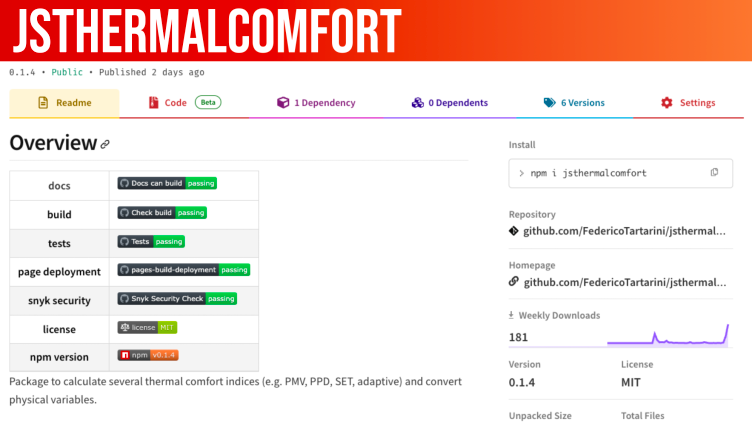

Excited to unveil jsthermalcomfort! 🚀 Built upon pythermalcomfort, jsthermalcomfort is crafted to facilitate seamless and precise thermophysiological modelling in JavaScript. 
With jsthermalcomfort, complex calculations in JavaScript become possible without the need for redundant programming efforts.

Thanks to: [Ollie Jay](https://www.linkedin.com/in/ollie-jay-793a1b11/), [Stefano Schiavon](https://www.linkedin.com/in/stefanoschiavon/), Omar Acuache, Ruoshui Chen, Lucas Lu, Yuchen MU, Jordan Ocokoljic, Santiago Zaldivar De Alba, Akihisa Nomoto