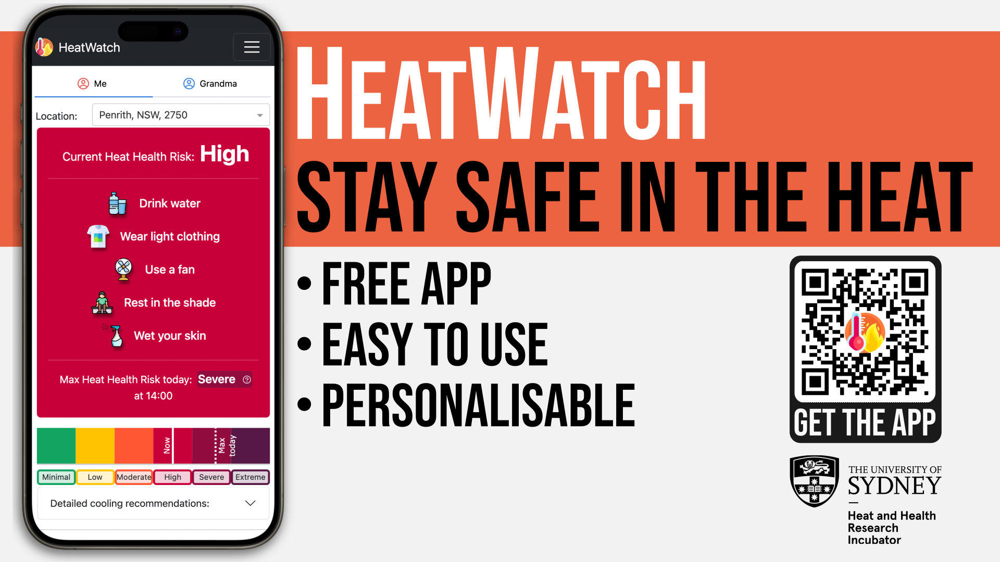

I am extremely proud to announce that I was awarded the "outstanding video" (first prize) in the [2023 Video Challenge from the journal Buildings & Cities](https://www.buildingsandcities.org/video-challenge/gallery-2023.html).

The video describes the "HeatWatch" application that I am co-developing at [Heat and Health Research Incubator](https://www.sydney.edu.au/medicine-health/our-research/research-centres/heat-and-health-research-incubator.html) with [Ollie Jay](https://www.linkedin.com/in/ollie-jay-793a1b11/).
My video addresses one of the grand challenges the world is currently facing: "Building Resilience to heatwaves and extreme heat".

You can watch my 2-min video on the [Buildings & Cities](https://www.buildingsandcities.org/video-challenge/gallery-2023.html) website.

<!--truncate-->

The videos were selected by a diverse group of 5 judges. 
Thank you all for watching my video and for giving an extremely positive rating to my video.

The HeatWatch is a web application that people in the community can use to calculate their personalised heat health risk. 
The application is free to use, you can access it via this [link](https://heatwatch.sydney.edu.au/). 
You can read more about the HeatWatch in [this blog post](../2023-10-20-heatwatch/index.md).

