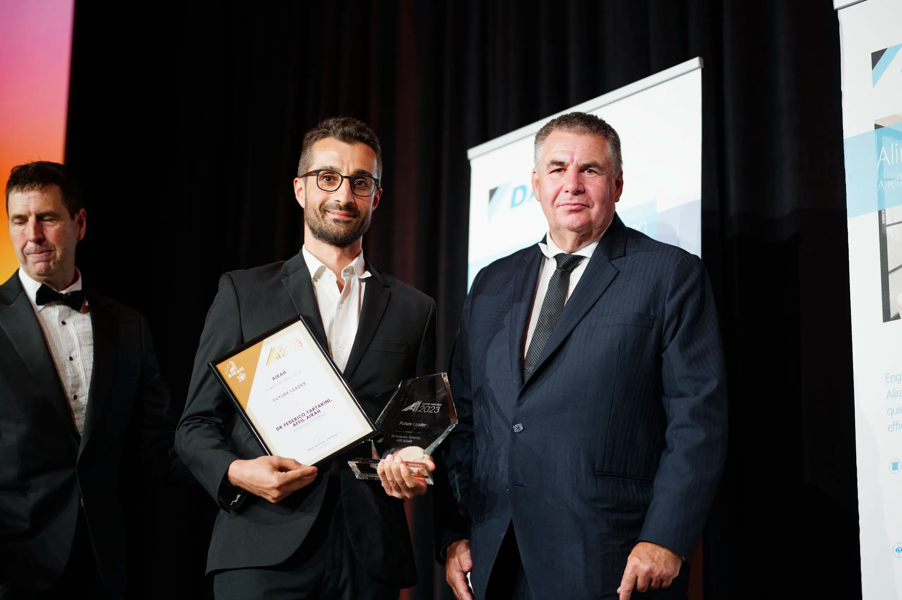
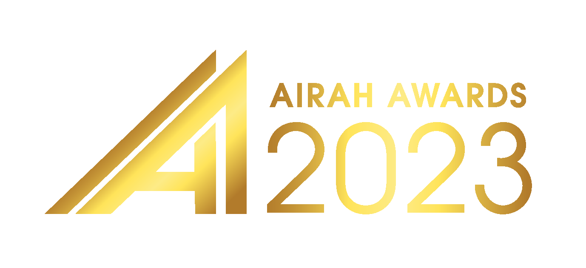
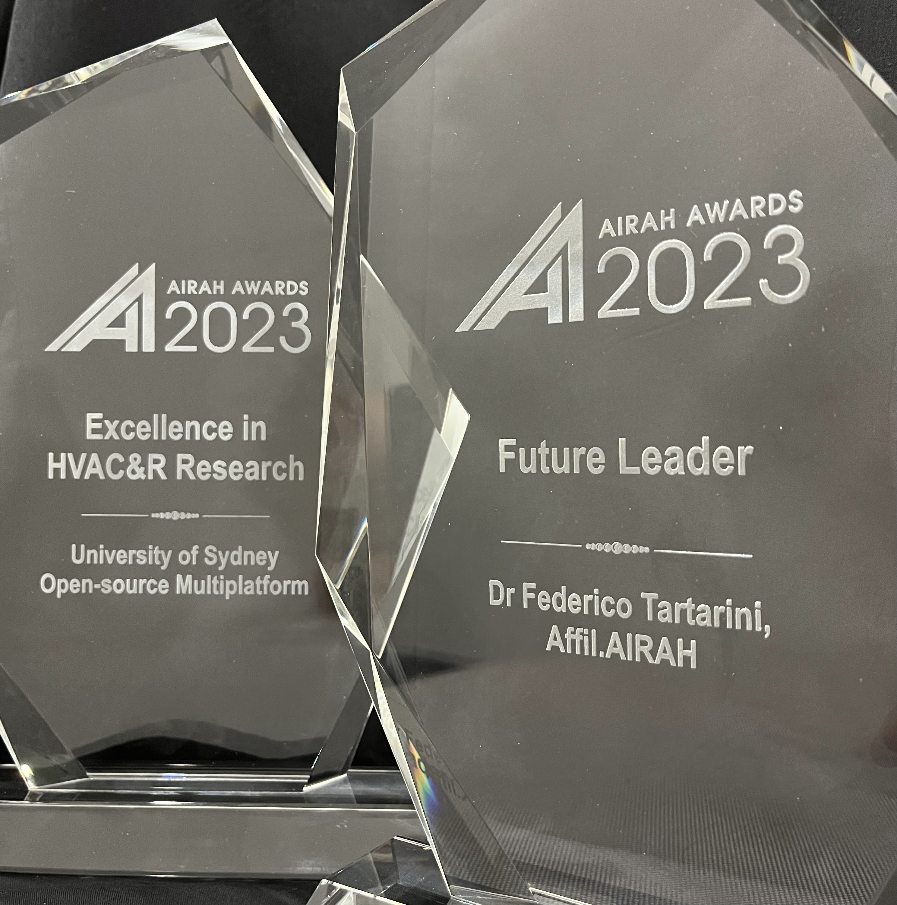
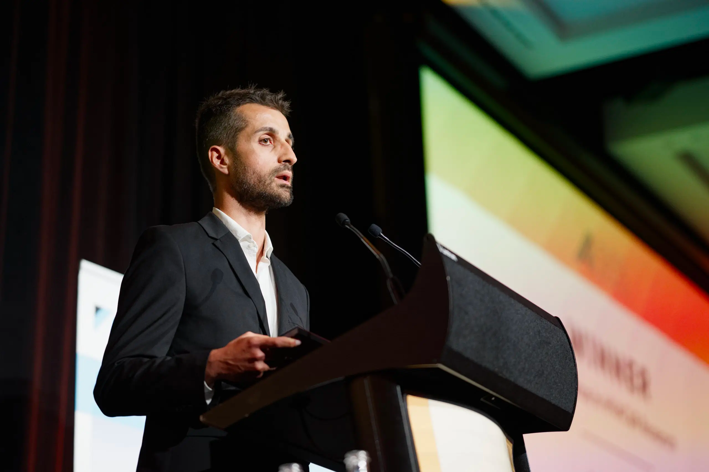

I feel very honoured to be the recipient of two prestigious awards from [AIRAH](https://www.airah.org.au/awards/winners/2023):
- the Future Leader Award and 
- the Excellence in HVAC&R Research. 

A heartfelt thank you to AIRAH for recognizing my contribution to this field.

<!--truncate-->

    

        
    

The Future Leader award recognises my research which aims to determine how the thermal environment impacts thermalcomfort, productivity, wellbeing, and health; and how to reduce the energy consumption of buildings.

The Excellence in HVAC&R Research reflects the impact that the tools I had the privilege to create and co-develop are having on the hvac field. This includes the [CBE Thermal Comfort Tool](/docs/tools/cbe-comfort-tool), [CBE Clima Tool](/docs/tools/cbe-clima-tool), [pythermalcomfort](/docs/tools/pythermalcomfort), [jsthermalcomfort](/docs/tools/jsthermalcomfort), Cozie, [HeatWatch](/docs/tools/heatwatch), and SMA Extreme Heat Tool.

    

        
    

The guidance and mentorship of my supervisors have been instrumental in this achievement. 
Professors Gian Luca Morini, Paul Cooper, Richard Fleming, Stefano Schiavon, Clayton Miller, Kwok Wai Tham, and Ollie Jay - your support, guidance, and wisdom have been invaluable.

In addition, I would like to thank all my present and past colleagues and friends at the University of Bologna (Alma Mater Studiorum – Università di Bologna), University of Wollongong, Center for the Built Environment (CBE), Berkeley Education Alliance for Research in Singapore (BEARS), National University of Singapore, and Heat and Health Research Incubator.

