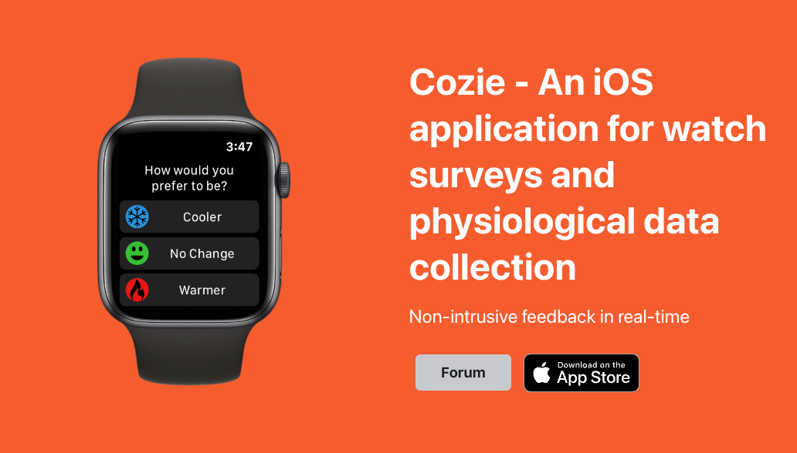

We published an article about [Cozie](/docs/tools/cozie) - An iOS application for watch surveys and physiological data collection.

Cozie is a platform that allows people to complete a watch-based micro-survey and provide real-time feedback about environmental conditions via their Apple Watch in a non-intrusive way. 
It leverages the built-in sensors of the smartwatch to collect physiological (e.g., heart rate, activity) and environmental (sound level) data. 
Cozie also enables researchers and practitioners to send push notifications and reminders to participants, and access data in real-time.

<iframe width="100%" class="youtube-video" src="https://www.youtube.com/embed/5e4FwVydYRE?si=Wsk6qayHUpCtKyvK" title="YouTube video player" frameborder="0" allow="accelerometer; autoplay; clipboard-write; encrypted-media; gyroscope; picture-in-picture; web-share" allowfullscreen></iframe>

<!--truncate-->

If you are interested in learning more about Cozie, you can visit the [official website](https://cozie-apple.app/), where you can find the documentation, video tutorials, and the open-source code. 
You can also contact the Cozie team at cozie.app@gmail.com for any inquiries or feedback. 

Reference
[Federico Tartarini et al. Cozie Apple: An iOS mobile and smartwatch application for environmental quality satisfaction and physiological data collection 2023 J. Phys.: Conf. Ser. 2600 142003](https://iopscience.iop.org/article/10.1088/1742-6596/2600/14/142003)
