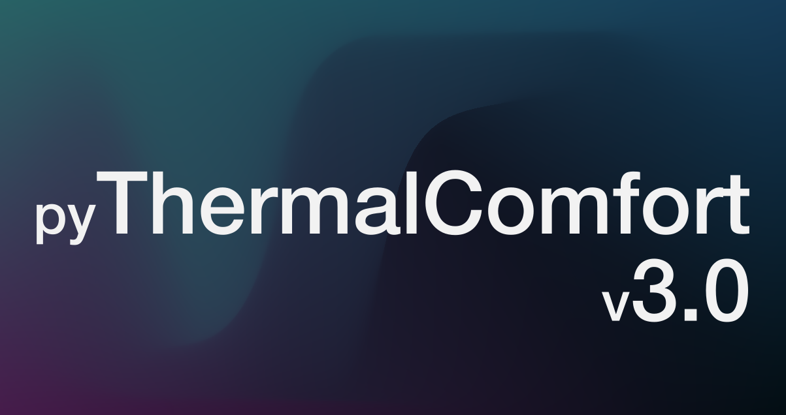

## **Why Should You Use pythermalcomfort?**
The thermal environment significantly affects thermal comfort, occupant well-being, health, and productivity.
However, calculating thermal comfort, heat, or cold stress indices can be complex and time-consuming.
That’s where **pythermalcomfort** comes in.
This Python package simplifies the process by providing accurate, standards-compliant calculations for thermal comfort and heat/cold stress indices.

<!-- truncate -->

---

## **What’s New in pythermalcomfort v3.0?**
Version 3.0 is a major leap forward, packed with new features and improvements:

1. **Multi-node models**
   Pythermalcomfort now includes JOS3 a multi-node model to estimate physiological variables (e.g., skin temperature, core temperature, and skin wettedness)
2. **Structured Results with Dataclasses**  
   Functions now return dataclass instances, making it easier to access and organize results. For example:
   ```python
   from pythermalcomfort.models import pmv_ppd_iso
   result = pmv_ppd_iso(tdb=[22, 25], tr=25, vr=0.1, rh=50, met=1.4, clo=0.5, model='7730-2005')
   print(result.pmv)
   print(result.ppd)
   ```  
   This change enhances readability and usability, especially when working with multiple outputs.

3. **Updated Function Names and Organization**
   - PMV functions are now named consistently (e.g., `pmv_ppd_ashrae`, `pmv_ppd_iso`).
   - Psychrometric functions have been moved to `utilities.py` for better organization.

4. **Array as inputs**  
   All functions now accept arrays as inputs, enabling faster batch processing of multiple inputs.

5. **Enhanced Documentation and Testing**
   - More examples and detailed descriptions of models.
   - Added input validation to ensure inputs are within model applicability limits.

6. **New Features**
   - Added surveys to assess thermal comfort in the documentation.
   - Included a detailed section on clothing insulation.

---

## **How to Get Started**
Using pythermalcomfort v3.0 is easier than ever. 
Here’s a simple example to calculate PMV (Predicted Mean Vote) using the ISO 7730 standard:

```python
from pythermalcomfort.models import pmv_ppd_iso

# Input parameters
result = pmv_ppd_iso(tdb=[22, 25], tr=25, vr=0.1, rh=50, met=1.4, clo=0.5, model='7730-2005')

# Access results
print("PMV:", result.pmv)
print("PPD:", result.ppd)
```  

This example demonstrates how straightforward it is to perform thermal comfort calculations with pythermalcomfort.

---

## How to Cite pythermalcomfort

If you are using pythermalcomfort please cite the package as follows: Tartarini, F., Schiavon, S., 2020. pythermalcomfort: A Python package for thermal comfort research. SoftwareX 12, 100578. https://doi.org/10.1016/j.softx.2020.100578

Please also do not forget to cite the specific model you are using.

---

## **Upgrading from to v2.0 to v3.0?**
Please note that pythermalcomfort v3.0 introduces several breaking changes, including updated function names and structured results.
Hence, this upgrade may require adjustments to your existing codebase.

#ThermalComfort #BuildingScience #Python #HVAC #pythermalcomfort #heat #heatstress #coldstress
