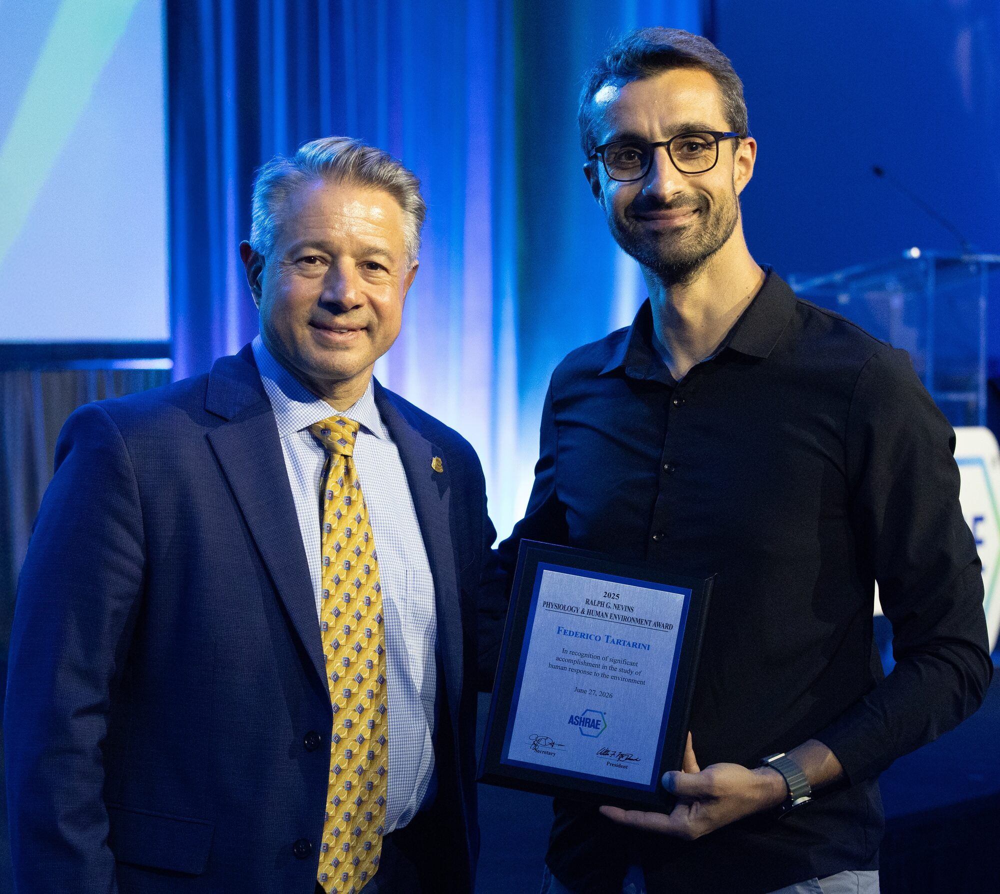
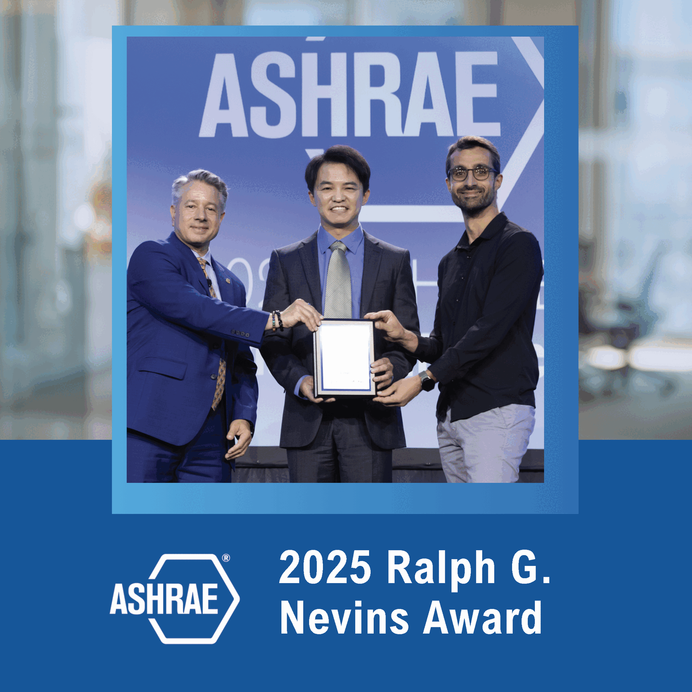
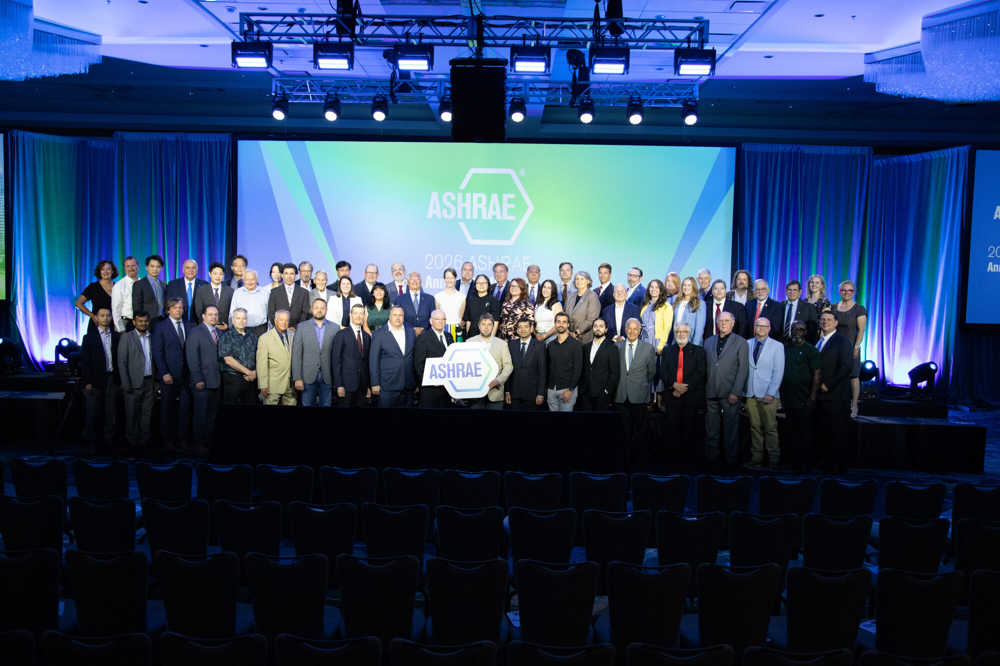

I was honoured to receive the 2025 [Ralph G. Nevins Physiology and Human Environment Award](https://www.ashrae.org/technical-resources/technical-committees/ralph-g-nevins-physiology-and-human-environment-award) from ASHRAE, presented in person at their 2026 annual conference.

<!--truncate-->

The award recognises a promising investigator for significant accomplishment in the area of human response to the environment, covering thermal, moisture, visual, acoustical and other effects on human health, comfort, and well-being. It is recommended by TC 2.1 (Physiology and Human Environment) and given to one researcher per year.

        

This recognition means a great deal to me. The research that connects thermal science to real outcomes for people's lives is what drives me, and having it acknowledged by ASHRAE gives me even more motivation to keep pushing forward.

None of this would have been possible without the people who shaped my path. Thank you to [Paul Cooper](https://scholars.uow.edu.au/paul-cooper) at the University of Wollongong for supervising my PhD, and to [Stefano Schiavon](https://ced.berkeley.edu/people/faculty/schiavon) (UC Berkeley) and [Ollie Jay](https://www.sydney.edu.au/medicine-health/about/our-people/academic-staff/ollie-jay.html) (University of Sydney), who have been exceptional supervisors and continue to be my mentors. I am also grateful to the School of Architecture, Design and Planning at the University of Sydney for the Horizon Fellowship that made this work possible, and to the members of TC 2.1 for recommending me.

        

You can read the full ASHRAE press release [here](https://www.ashrae.org/about/news/2026/ashrae-recognizes-outstanding-member-achievements-at-annual-conference).

## Past recipients

| Year | Recipient | Year | Recipient | Year | Recipient              |
|------|-----------|------|-----------|------|------------------------|
| 1978 | James E. Woods | 1995 | Marc E. Fountain | 2012 | Lily M. Wang           |
| 1979 | Larry G. Berglund | 1996 | William J. Fisk | 2013 | Stefano Schiavon       |
| 1980 | Yasunobi Nishi | 1997 | Clifford C. Federspiel | 2014 | Benjamin Yan Bing      |
| 1981 | Donald A. McIntyre | 1998 | *(No award given)* | 2015 | Zhecho Bolashikov      |
| 1982 | Bjarne W. Olesen | 1999 | Jorn Toftum | 2016 | Jovan Pantelic         |
| 1983 | Richard R. Gonzalez | 2000 | Lei Fang | 2017 | *(No award given)*     |
| 1984 | Deanna M. Munson | 2001 | Jerry M. Sipes | 2018 | Dusan Licina           |
| 1985 | Elizabeth McCullough | 2002 | Pawel Wargocki | 2019 | Bin Cao                |
| 1986 | Lars Molhave | 2003 | Yanzheng Guan | 2020 | Shichao Liu            |
| 1987 | Richard B. Hayter | 2004 | Zhang Hui | 2021 | Yongchao Zhai          |
| 1988 | Byron W. Jones | 2005 | Christopher Chao | 2022 | Thomas Parkinson       |
| 1989 | Gail Ellen Schiller | 2006 | *(No award given)* | 2023 | Li Lan                 |
| 1990 | Shin-ichi Tanabe | 2007 | Charlie Huizenga | 2024 | *(No award given)*     |
| 1991 | Geo Henrik Clausen | 2008 | Henry C. Willem | 2025 | **Federico Tartarini** |
| 1992 | Kenneth C. Parsons | 2009 | *(No award given)* | 2026 | Meng Kong              |
| 1993 | Richard J. De Dear | 2010 | Gwelen Paliaga | |                        |
| 1994 | Amanda K. Meitz | 2011 | Jan Kaczmarczyk | |                        |
