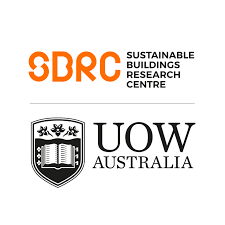

# Work Experience

 

## Senior Lecturer | USYD Horizon Fellow
**School of Architecture Design and Planning, the University of Sydney**  
_Sydney, AU_  
_Jun 2024 - Present_

- Beat the Heath - Advancing Our Understanding of Heat Stress and Developing Effective Sustainable Interventions to Reduce Health Risks in a Warming World.
- Teaching - Thermal Comfort, Building Science, and Building Physics.

 

## ASHRAE 55 Committee Voting Member
**ASHRAE**  
_Atlanta, US_  
_Nov 2020 - Present_

- Member of the SSPC 55 "Thermal Environmental Conditions for Human Occupancy" committee
- Contributed to the development of the 2020 edition of the Standard.
- Wrote 7 addenda, which have all been approved.

 

## Honorary Fellow
**University of Wollongong**  
_Wollongong, AU_  
_Jun 2019 - Present_

- Honorary fellow at the Sustainable Buildings Research Centre (SBRC), faculty of Engineering and Information Sciences.

 

## Senior Research Associate
**Heat & Health Research Incubator at the University of Sydney**  
_Sydney, AU_  
_Oct 2022 - Jun 2024_

- Maintainer and developer of the [HeatWatch](https://heatwatch.sydney.edu.au/).
- Maintainer and developer of the [SMA Extreme Heat Policy Tool](https://sma-heat-policy.sydney.edu.au/).
- Main author of [jsthermalcomfort](https://www.npmjs.com/package/jsthermalcomfort) a package crafted to facilitate seamless and precise thermophysiological calculations in JavaScript.

 

## Postdoctoral Scholar
**Berkeley Education Alliance for Research in Singapore (BEARS)**  
_Singapore, SG_  
_Jun 2019 - Oct 2022_

- Maintainer and developer of the [CBE thermal comfort tool](../tools/cbe-comfort-tool.md) and the [CBE Clima Tool](../tools/cbe-clima-tool.md).
- Main author of [pythermalcomfort](../tools/pythermalcomfort.md) a Python package for thermal comfort research.
- Maintainer and developer of Cozie for iOS and Fitbit.
- Conducted a longitudinal thermal comfort study which aimed to developed personalized thermal comfort models using wearable and IoT devices.
- Collaborated in the construction and commissioning of the "Greenest building" in Singapore. A net a net zero energy building for the Singaporean Building and Construction Authority (BCA).
- Conducted research relating to SinBerBEST Theme A: Human-Building Nexus - Enhancing Health and Productivity in the Built Environment. Worked on issues related to thermal comfort, indoor air quality, human performance, and HVAC systems.
- Conducted research relating to SinBerBEST Theme A: Human-Building Nexus - Enhancing Health and Productivity in the Built Environment. Worked on issues related to thermal comfort, indoor air quality, human performance, and HVAC systems.

 

## Associate Research Fellow
**SBRC, University of Wollongong**  
_Wollongong, AU_  
_Jun 2017 - Jun 2019_

- Industrial research projects: Company: Daikin Australia. Developed smart controllers and IoT sensors for Daikin.
- Advantages SME grant: Company: Enviro Buildings Services. Developed learning algorithms using Python and Matlab for self-commissioning of HVAC components and models for performance prediction.
- International Energy Agency Energy in Buildings and Communities (IEA EBC) Annex 69: Represented the SBRC in the IEA EBC Annex 69 "Strategy and practice of adaptive thermal comfort in low energy buildings".
- Data Scientist: Helping colleagues analysing data in several research project and assisted the SBRC in the development of research facilities in relation to data acquisition, storage and analysis.
- Developer: Developed two Android applications, one written in Java and one using Xamarin Forms.
- Teaching Assistant - HVAC systems: Delivered a number of tutorials and developed course material for the UOW Engineering subject ENG 442/918 "Sustainable Energy in Buildings".
- Guest Lecturer - University of Sydney: Delivered a guest lecture on the Solar Decathlon Competition.

## Consultant
**NIER ING, ITALY**  
_Bologna, IT_  
_Mar 2013 - Feb 2014_

- Conducted feasibility studies for private and public clients. Modelled building energy consumption using EnergyPlus.

