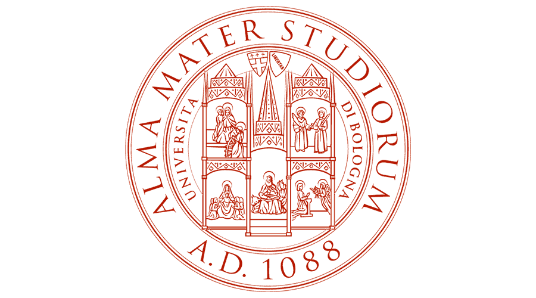

# Education

 

## PhD in Engineering and Information Sciences
**University of Wollongong - Faculty of Engineering**  
_Wollongong, AU_  
_Mar 2014 - Dec 2017_

- Thesis title: "Impact of temperature and indoor environmental quality in nursing homes on thermal comfort of occupants and agitation of residents with dementia".

 

## Master of Science Degree in Energy Engineering
**University of Bologna - Faculty of Engineering**  
_Bologna, IT_  
_Sep 2010 - Mar 2013_

- Grade: 110/110 with honours

 

## Exchange Program
**University of Wollongong - Faculty of Engineering**  
_Wollongong, AU_  
_Sep 2012 - Feb 2013_

 

## Exchange Program
**Technical University of Copenhagen - Faculty of Engineering**  
_Copenhagen, DK_  
_Jan 2011 - Jun 2011_

 

## Bachelor Degree in Energy Engineering
**University of Bologna - Faculty of Engineering**  
_Bologna, IT_  
_Sep 2007 - Jul 2010_

- Grade: 108/110
