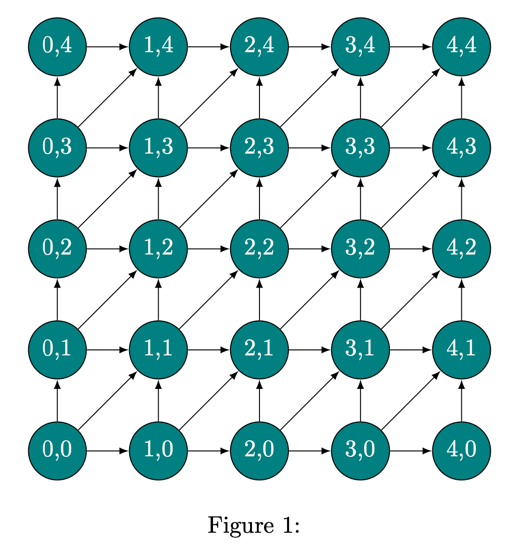
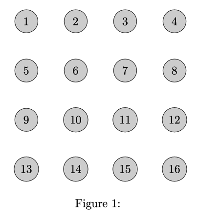
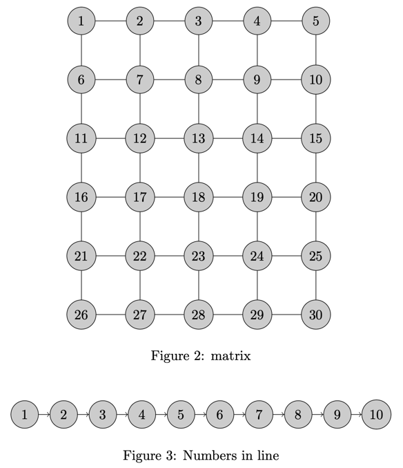

## Loops and Conditionals

This guide will introduce you to using for loops and if statements in LaTeX. 
These commands are helpful for automating repetitive tasks and including conditional content in your documents.

### foreach Loop (package: pgffor)
This loop iterates over a comma-separated list and executes a block of code for each item.

#### Example 1: Printing Numbers 1 to 5

```latex
\foreach \i in {1,...,5}{
    $\i$ ,
}
```

#### Example 2: Listing Fruits

```latex
\foreach \fruit in {apple, banana, cherry} {
    I like \fruit s. \\
}
```

Explanation:

This loop iterates over a list of fruits ("apple", "banana", "cherry").
The loop variable \fruit takes the value of each fruit in the list.
Additional Notes:

### forloop Loop (package: forloop)

You can use more complex loop variables like counters defined with `\newcounter` and `\forloop`.
For example, you can use them as follows:

```latex
\newcounter{x}
    \forloop{x}{1}{\value{x} < 10}{%
        The number is \arabic{x}. \\
    }
```

### multido Loop (package: multido)
This loop performs a certain number of repetitions based on a start, stop value, and increment.

#### Example 1: Printing 3 numbers from 6 (increment of 5)

```latex
\multido{\i=6+5}{3}{%
    Print whatever you want here, \i. \\
}
```

Explanation:

`\multido{\i=6+5}{3}` defines the loop with:
`\i`: loop variable starting at 6 and incrementing by 5.
3: number of repetitions.
The loop body is similar to the foreach loop.

#### Example 2: Printing Floats

```latex
% n stands for number and can be float
\multido{\n=1.66+0.35}{3}{%
    Print whatever you want here, \n. \\
}
```

#### Example 3: Conditional Printing with `\ifthenelse`

`\ifthenelse` requires the `forloop` package.

`\ifthenelse{condition}{true}{false}` is a conditional statement that prints "true" if the condition is met and "false" otherwise.

```latex
\multido{\i=1+2}{10}{%
   $\i$ is \ifthenelse{\i < 5}{smaller}{bigger} than 5\\
}
```

Explanation:

This loop iterates 10 times from 1 with an increment of 1.
The `\ifthenelse` command checks a condition (`\i` < 5).
If true, "smaller" is printed.
If false, "bigger" is printed.
Note: This example requires the `forloop` package, which might not be standard.

#### Example 4: Importing Figures

You first need to include the following packages in your document preamble.

```latex
\usepackage{caption,subcaption}
\usepackage{graphicx}
```

Then you can use the following code to import figures with captions:

```latex
\multido{\i=1+1}{3}{%
    \begin{figure}[htb!]
        \centering
        \includegraphics[width=.5\linewidth]{figures/figure\i}
        \caption{Caption \i}\label{fig:figure\i}
    \end{figure}
}
```

Explanation:

This loop imports three figures (figure1.png, figure2.png, figure3.png) with captions that vary as a function of `\i`.

The same can be done with tables, equations, or any other content that needs to be repeated with slight variations.

You can also use the `foreach` loop to import figures, tables, or other content with slight variations.

```latex
\foreach \i in {1,...,3} {
     \begin{figure}[htb!]
         \centering
         \includegraphics[width=.5\linewidth]{figures/figure\i}
         \caption{Caption \i}\label{fig:figure\i}
     \end{figure}
}

As shown in Figure~\ref{fig:figure1}, Figure~\ref{fig:figure2}, and Figure~\ref{fig:figure3}, ...
```

The code snippet above imports three figures with captions and labels that vary as a function of `\i`.
Then I reference the figures in the text using the `\ref` command.

You can also a variation of the above command to create subfigures:

```latex
\begin{figure}[htb!]
 \foreach \i in {1,...,3} {
     \begin{subfigure}[p]{0.47\textwidth}
         \includegraphics[width=\linewidth]{figures/figure\i}
         \caption{}
     \end{subfigure}\quad
 }
 \caption{Main figure caption}\label{fig:subfig_1}
\end{figure}
```

Alternatively you can use this notation to create subfigures.
Here you can define the names of the figures in a list and then iterate over the list to create the subfigures.

```latex
\def\names{{figure1},{figure2},{figure3},{test}}

\begin{figure}
\foreach \name in \names {%
 \begin{subfigure}[p]{0.47\textwidth}
     \includegraphics[width=\linewidth]{figures/\name}
     \caption{}
 \end{subfigure}\quad
}
\caption{Main figure caption}\label{fig:subfig_2}
\end{figure}
```

This approach is useful when you have a list of figures that you want to include in a single figure with subfigures.
It also allows to easily provide a custom caption for each subfigure.

```latex
\def\names{{figure1/my caption for figure 1},{figure2/caption2},{figure3/caption3},{test/my caption}}

\begin{figure}
    \foreach \name/\subcap in \names {%
     \begin{subfigure}[p]{0.47\textwidth}
         \includegraphics[width=\linewidth]{figures/\name}
         \caption{\subcap}
     \end{subfigure}\quad
    }
    \caption{Main figure caption}\label{fig:subfig_2}
\end{figure}
```

### Loops and TikZ for Graphics (package: tikz)
LaTeX with TikZ allows creating graphics using loops. 
This code creates a grid of nodes using nested loops for x and y coordinates.

You will need to include the TikZ package in your document preamble.

```latex
\usepackage{tikz}
\usetikzlibrary{graphs.standard}
\usepackage[dvipsnames]{xcolor} % needed for non-standard colors
```

You can then create the following grid:



```latex
\begin{figure}
     \centering
         \begin{tikzpicture}[myNode/.style={circle,draw,fill=teal,text=white}]

     \foreach \x in {0,...,4}
     \foreach \y in {0,...,4}
        \node [myNode]  (\x\y) at (1.5*\x,1.5*\y) {\x,\y};

     \foreach \x in {0,...,4}
     \foreach \y [count=\yi] in {0,...,3}{
       \draw[-latex] (\x\y)--(\x\yi);
       \draw[-latex] (\y\x)--(\yi\x);
     }

     \foreach \x [count=\xi] in {0,...,3}
     \foreach \y [count=\yi] in {0,...,3}
       \draw[-latex] (\x\y)--(\xi\yi);

\end{tikzpicture}
  \caption{}\label{fig:figures}
\end{figure}
```

Explanation:

This code creates a 5x5 grid of nodes with coordinates (0,0) to (4,4).
Each node is a circle with a teal fill and white text.
The `\foreach` loops create the nodes and draw arrows between adjacent nodes.
The `count` option is used to create the arrows between nodes.
`count` starts from 1 and increments by 1.
This example requires the TikZ package, which is commonly used for creating graphics in LaTeX.

Alternatively you can use the following code to create a grid of nodes with different colors:



```latex
\begin{figure}
    \centering
    \begin{tikzpicture}[darkstyle/.style={circle,draw,fill=gray!40,minimum size=20}]
        \foreach \i in {1,...,16}
        {
            \pgfmathtruncatemacro{\y}{(\i - 1) / 4}
            \pgfmathtruncatemacro{\x}{\i - 4 * \y}
            \pgfmathtruncatemacro{\lab}{\x + 4 * (3 - \y)}
            \node[darkstyle,minimum size=20] (\lab) at (1.5*\x,1.5*\y)
            {\lab};
        }
    \end{tikzpicture}
    \caption{}\label{fig:figure}
\end{figure}
```

Finally, you can also use the `tikz grap` library to create a graph of nodes:



```latex
\begin{figure}
    \centering
    \begin{tikzpicture}
        \graph [simple necklace layout, nodes={draw, circle, fill=gray!40, minimum size=20}] {
            1 -> 2 -> 3 -> 4 -> 5 -> 6 -> 7 -> 8 -> 9 -> 10 -> 1;
        };
    \end{tikzpicture}
    \caption{}\label{fig:figure}
\end{figure}

\begin{tikzpicture}
    \graph [nodes={draw, circle, fill=gray!40, minimum size=20}] {
        1 -> 2 -> 3 -> 4 -> 5 -> 6 -> 7 -> 8 -> 9 -> 10;
    };
\end{tikzpicture}
\caption{Numbers in line}\label{fig:figure}
```

## Python code

The Python code I used in the video is below:

```python
import glob

import matplotlib.pyplot as plt
import numpy as np

t = np.arange(0., 5., 0.2)

for i in range(1,4):
    plt.figure()
    plt.plot(t, t**i, 'r--', label=f"t^{i}")
    plt.savefig(f"./figures/figure{i}.png")


plt.figure()
plt.plot([0,-10], [0, 10])
plt.savefig(f"./figures/test.png")

with open("./figures/sub_figures.tex", "w") as f:
    figures = glob.glob("./figures/*.png")
    f.write("\\begin{figure} \n")
    for figure in sorted(figures):
        f.write("\\begin{subfigure}[p]{0.47\\textwidth} \n")
        f.write("\\includegraphics[width=\\linewidth]{" + figure +"} \n")
        f.write("\\caption{} \n")
        f.write("\\end{subfigure}\\quad \n")
    f.write("\\caption{Main figure caption}\\label{fig:subfig_0} \n")
    f.write("\\end{figure} \n")


def add_figure(fig_name, size=1):
    return f"""
        \\begin{{figure}}[htb!]
        \\centering
        \\includegraphics[width={size}\\linewidth]{{{fig_name}}}
        \\caption{{Your Caption Here}} 
        \\end{{figure}}
        """

f = open("./figures/figures.tex", "w")
for figure in glob.glob("./figures/*.png"):
    f.write(add_figure(figure, 0.5))
f.close()
```