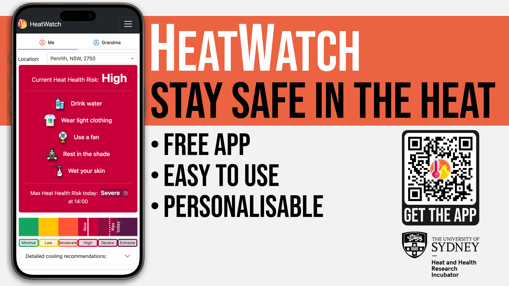

# HeatWatch

Heatwaves pose a significant threat to human health in New South Wales (NSW) and across Australia, claiming more lives than any other natural disaster. Numerous barriers hinder the reduction of health risks associated with extreme heat exposure. In response, the [Heat and Health Research Incubator](https://www.sydney.edu.au/medicine-health/our-research/research-centres/heat-and-health-research-incubator.html) at The University of Sydney, in collaboration with community partners, developed the [HeatWatch application](https://heatwatch.sydney.edu.au/). The HeatWatch application allows users to estimate a personalised heat health risk. It also provides science-backed cooling strategies that are easily implementable. Its design and features are shaped by direct consultations with community members via focus groups, ensuring a user-friendly and practical tool for heatwave health risk management.

<iframe width="100%" height="300" src="https://www.youtube.com/embed/DjcMW1slwCw?si=yQmHSj72vgU5mz7B" title="YouTube video player" frameborder="0" allow="accelerometer; autoplay; clipboard-write; encrypted-media; gyroscope; picture-in-picture; web-share" allowfullscreen></iframe>

In recent times, heatwaves have become more intense, frequent, and prolonged — a trend that will escalate in the foreseeable future. As NSW's population continues to grow and age, it is crucial to safeguard the most vulnerable from the detrimental health effects of extreme heat, reinforcing the importance of the HeatWatch application. You can use the HeatWatch app for free using this [link](https://heatwatch.sydney.edu.au/), and enhance your understanding of its features and benefits through this [short educational video](https://youtu.be/DjcMW1slwCw).

 
