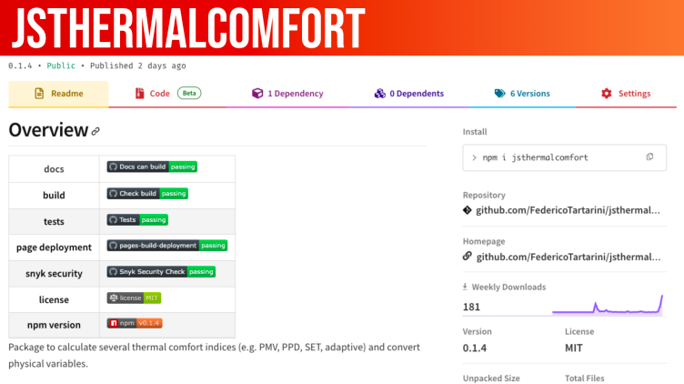

# jsthermalcomfort

>A JavaScript Solution for Thermophysiological Modelling

Professionals and researchers recognize the crucial role of accurate thermophysiological modelling in assessing thermal comfort conditions and estimating heat and cold stress, both indoors and outdoors. We are excited to introduce jsthermalcomfort, an open-source JavaScript package designed to streamline seamless and precise thermophysiological calculations.

 

Developed as an extension of [pythermalcomfort](https://www.linkedin.com/pulse/pythermalcomfort-python-package-thermal-comfort-federico-tartarini%3FtrackingId=V%252Bq8tVdyRGeUxhP0u3DK2w%253D%253D/?trackingId=Iq84nzagS0KF%2BV1vvWzHyQ%3D%3D&lipi=urn%3Ali%3Apage%3Ad_flagship3_pulse_read%3Be33VIO52RuaMpCPgoWE1ew%3D%3D), our open-source jsthermalcomfort package delivers an unparalleled advantage to the JavaScript and front-end developer community. With jsthermalcomfort, complex thermal comfort calculations in JavaScript become accessible without the need for redundant programming efforts.

We have validated all jsthermalcomfort functions against the reference tables in the corresponding standards and scientific publications. Furthermore, our team has diligently cross-verified the consistency of jsthermalcomfort results with its Python predecessor.

Our commitment to fostering a seamless user experience is reflected in the comprehensive [documentation](https://federicotartarini.github.io/jsthermalcomfort/) and [examples](https://github.com/FedericoTartarini/jsthermalcomfort/tree/main/docs/examples) provided.

## Acknowledgment: 

* We would like to acknowledge the work of Omar Jesus Acuache Briceno, Ruoshui Chen, Jingyu Lu, Yuchen MU, Jordan Ocokoljic, Santiago Zaldivar del Alba who contributed to the development of the NPM package. 
* Stefano Schiavon and Federico Tartarini who developed pythermalcomfort. 
* Akihisa Nomoto who integrated the JOS-3 model in pythermalcomfort. 
* Ollie Jay the Director of the Heat and Health Research Incubator in the Faculty of Medicine and Health - University of Sydney who supported this research.