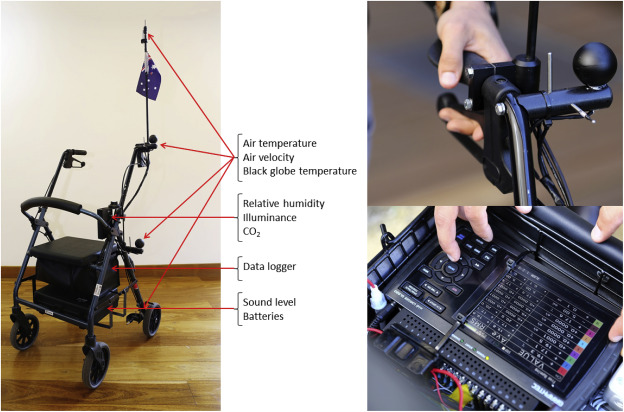
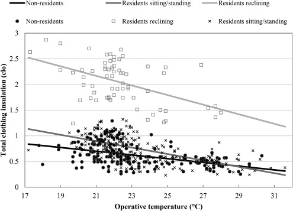
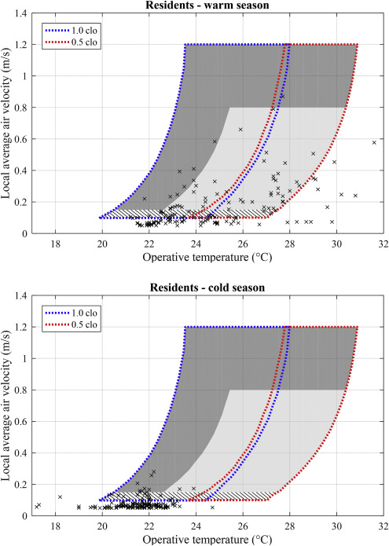

---
tags:
  - research
keywords: 
  - thermal comfort
  - personal comfort models
  - machine learning
  - wearables
  - IoT
image: ./img/tc-nursing-homes.jpg
description: This article describes a longitudinal study that used wearables and machine learning to model personal thermal comfort
last_update:
  author: Federico Tartarini
---

# Thermal Comfort in Nursing Homes: Understanding Residents' Perceptions and Preferences

**The Problem:** 
There is limited research on how residents of nursing homes perceive their thermal environment, and a lack of thermal comfort guidelines for the aged care sector. 
This is a significant issue because the number of people living in nursing homes is increasing rapidly, and many residents may have specific needs due to age and health conditions. 
Furthermore, **existing thermal comfort models might not accurately predict the needs of older adults,** particularly those with dementia, who may perceive their environment differently.

**Methodology:** 
A field study was conducted in five nursing homes in south-eastern NSW, Australia, during both warm and cold seasons. 
Participants included residents, staff, and visitors. 
Researchers collected data on indoor environmental parameters, physical characteristics of the participants, and personal preferences using a questionnaire. 

 

Participants were asked to report how they felt about their thermal environment and whether they would prefer to be warmer or cooler. 
The study also considered adaptive behaviors employed by participants, such as adjusting clothing or using fans.

**Key Results:** 
The study found that indoor air temperatures in nursing homes varied widely, ranging from 17.2 °C to 31.6 °C. 
Residents were more tolerant of temperature variations than staff or visitors, and their preferred temperatures were generally higher. 
**Participants adjusted their clothing and used fans to adapt to uncomfortable conditions**. 
The study also found that:
*   Residents' clothing insulation increased with age and decreased with operative temperature.

 

*   Air velocity increased with operative temperature, likely due to the use of personal cooling fans.

 

*   The Predicted Mean Vote (PMV) model was not a precise predictor of the personal thermal state of participants.
*   Residents were comfortable when the PMV index was negative, indicating they preferred a slightly cooler environment than predicted by the model.

Read the [paper](https://doi.org/10.1016/j.buildenv.2018.01.018) for more details on the study and its findings.
