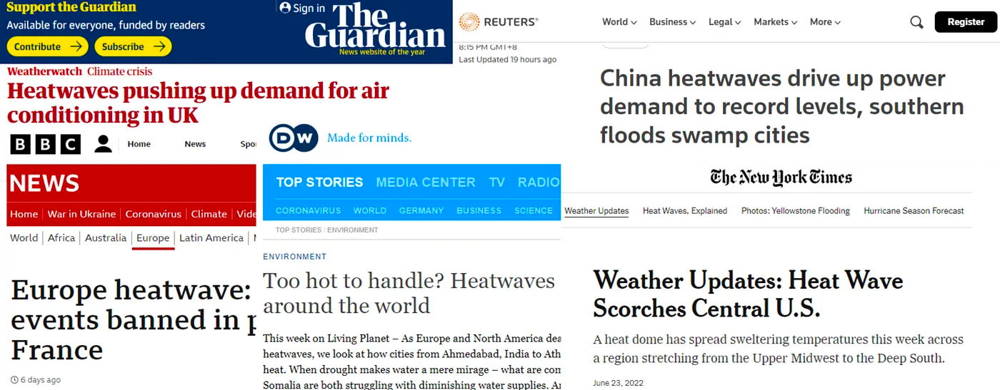

---
tags:
  - research
keywords: 
  - thermal comfort
  - heat stress
  - air movement
  - energy consumption
  - retrofit
image: ./img/bca-results.png
description: This article describes the effectiveness of fans in cooling you down during an heatwave
last_update:
  author: Federico Tartarini
---

# Can electric fans cool you down during heatwaves?

Finding affordable and effective ways to cool people has become a primary focus as cities around the world experience record-breaking temperatures. Heatwaves are one of the most severe natural disasters, having claimed the lives of almost 166 000 people between 1998 and 2017, and their frequency and intensity are increasing.

 

Air conditioning is an effective solution, but not everyone can afford it and many electrical grids cannot provide sufficient power during the summer. Moreover, air conditioning use exacerbates global greenhouse gas emissions.

Electric fans are a cost-effective and energy-efficient way to keep people cool. However, many national and international health guidelines conservatively restrict their use to when air temperatures are lower than skin temperature, which is around 35°C (95°F).

 

[In a study](https://www.sciencedirect.com/science/article/pii/S0360132321008325) published in January 2022 in Building and Environment we used a human heat balance model to identify under which environmental (e.g., temperature, relative humidity, airspeed) and personal (activity, clothing) conditions the use of fans is beneficial to cool healthy adults.

 

We demonstrated that current guidelines are too restrictive. Even if the indoor dry-bulb temperature surpasses 35°C (95°F), electric fans can still be used safely because they considerably enhance the amount of sweat that evaporates from the skin. For relative humidity values above 22%, using higher air velocity (0.8 m/s (~160 fpm)) increases the critical operative temperature at which heat strain is projected to develop by an average of 1.4°C (~2.5°F). We also looked at the most extreme weather occurrences from 1990 to 2014 in the world’s 115 most populous cities and found that using fans would have been beneficial in 93 of them.

 

Currently, many people may not be taking advantage of this cooling strategy because public health organizations advise against using fans during heat waves. Public health officials should revise their recommendations for when people should use fans.

Given the environmental impact of high-energy cooling solutions such as air conditioning, we believe that developing less taxing options such as fans or dousing with cool water is vital for the planet.

To help people worldwide we created a free, open-source, and user-friendly online tool to assist researchers, designers, and policymakers in better understanding the conditions under which electric fans can be used to cool people safely. You can try our tool using this link. We summarized the work in this LinkedIn post.

Authors: Dr. Federico Tartarini, SinBerBEST; Prof. Stefano Schiavon, UC Berkeley; Prof. Ollie Jay, The University of Sydney; Edward Arens, UC Berkeley; and, Charlie Huizenga, UC Berkeley.