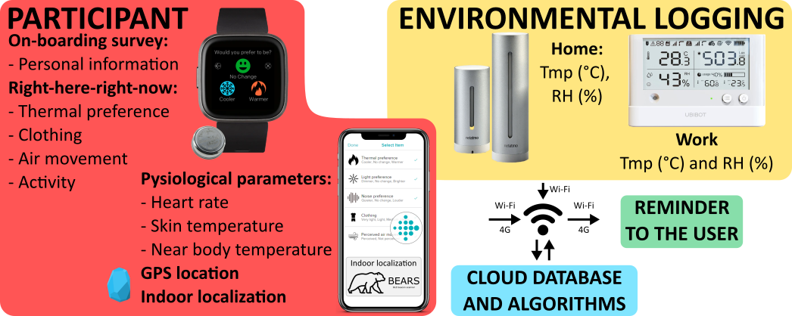
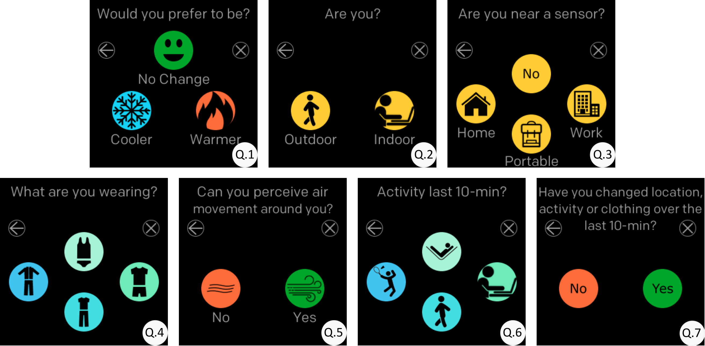
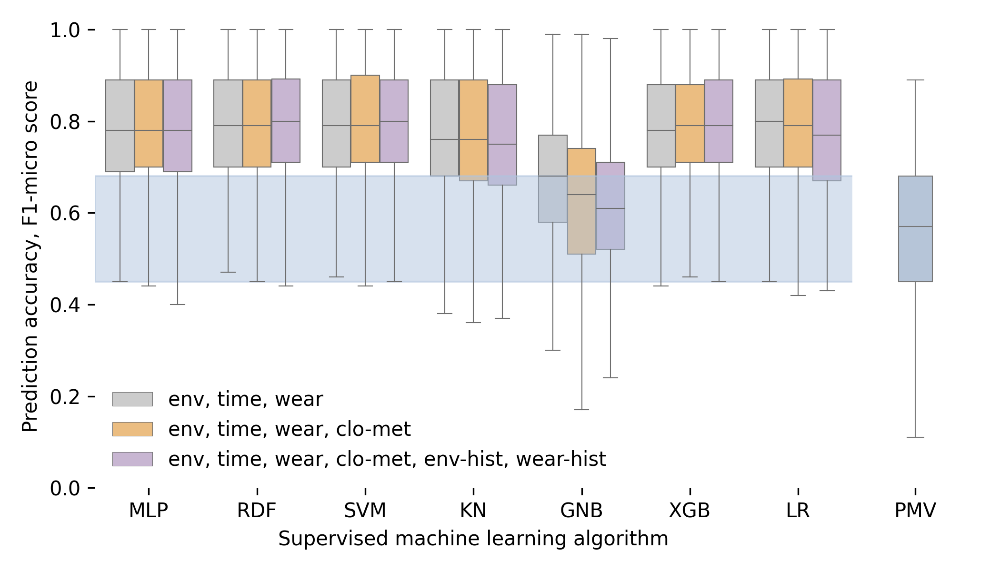

---
tags:
  - research
keywords: 
  - thermal comfort
  - personal comfort models
  - machine learning
  - wearables
  - IoT
image: ./img/dorn.png
description: This article describes a longitudinal study that used wearables and machine learning to model personal thermal comfort
last_update:
  author: Federico Tartarini
---

# Using Wearables and Machine Learning to Model Personal Thermal Comfort

**The Problem:** Traditional thermal comfort models often fail to accurately predict individual preferences, as they are based on average responses from groups of people. 
These models also struggle with real-world application because of the difficulty in accurately measuring input variables such as metabolic rate, clothing, airspeed, and mean radiant temperature. 
Additionally, these models do not adapt or learn from new feedback. 
This study aimed to develop personal comfort models using machine learning algorithms and wearable devices to predict individual thermal preferences.

 

**Methodology:** A study was conducted using 20 participants who wore Fitbit smartwatches with attached iButtons to collect physiological data over a 6-month period. 
Participants used the Cozie app on their smartwatches to complete "Right-Here-Right-Now" surveys about their thermal preferences. 

 

Environmental data was collected using sensors in their homes and workplaces. 
Machine learning models were then trained for each participant using this data to predict their individual thermal preferences. 
The study aimed to determine how many data points were needed to develop a reliable personal comfort model and whether environmental and physiological data were sufficient to train these models. 
The study also explored the use of micro-EMA, using smartwatches to reduce survey fatigue.

**Key Results:** The study found that personal comfort models, when trained using machine learning algorithms, had a significantly higher prediction accuracy than the traditional Predicted Mean Vote (PMV) model. 
The models achieved a median prediction accuracy of 0.78 (F1-score). 

 

Approximately 250-300 data points per participant were needed for accurate prediction. 
Key variables for prediction included skin, indoor, and near-body temperatures, and heart rate. 
The study also found that self-reported clothing and activity levels did not significantly increase prediction accuracy, and that the use of historical data did not always improve model accuracy. 
The models also showed that individuals can have very different thermal comfort needs, requirements and preferences, even in similar environments.

**Practical Outcomes:** The findings of this study have several practical implications. 
The methodology and results can be used in buildings to develop and implement occupant-centric controls, which can enhance indoor thermal comfort and potentially reduce overall building energy consumption. 
The study provides quantitative evidence on how to improve the accuracy of personal comfort models, and demonstrates the benefits of using wearable devices to predict thermal preference. 
The open-source data and code from this study are available for other researchers to use and develop more effective personal comfort models. 
This data can be used to test various assumptions and develop personal comfort models using different methodologies.

Read the [paper](https://doi.org/10.1111/ina.13160) for more details on the study and its findings.
