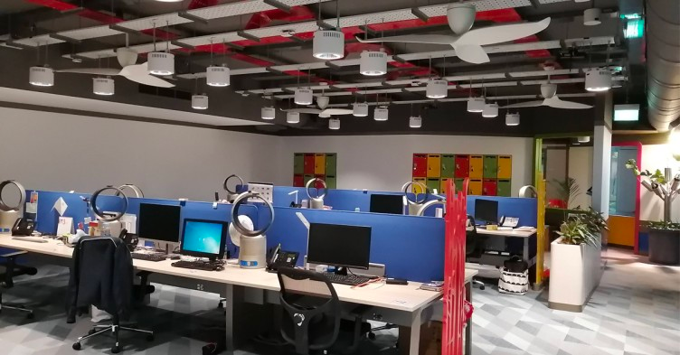
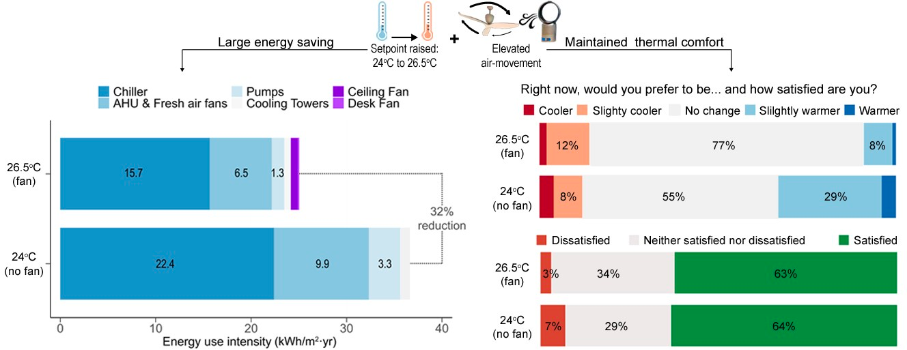

---
tags:
  - research
keywords: 
  - thermal comfort
  - productivity
  - air movement
  - energy consumption
  - retrofit
image: ./img/bca-results.png
description: This article describes the research we did in Singapore about reducing the energy consumption of a commercial building by increasing the cooling set-point and moving the air using fans
last_update:
  author: Federico Tartarini
---

# Redefining Cooling Solutions in Hot Climates

🌀✨ Shaping a Sustainable Future: Redefining Cooling Solutions in Hot Climates 🏢🌞

What if I told you that fans, working hand in hand with AC systems, can significantly slash energy consumption? 🌬️❄️ 
Our findings show that fans are the future of efficient cooling. By embracing them, we unlock energy reductions, sustainable practices, and enhanced comfort for all.

 

Cooling buildings in hot and humid climates like Singapore is no small feat, often demanding a hefty share of our energy resources. The challenge lies in finding smarter solutions that don't compromise on comfort while driving sustainability. Electric fans – an affordable and energy-efficient ally in our quest for a greener tomorrow.

In a groundbreaking initiative, we've introduced fans to the iconic Zero Energy Building at the Building and Construction Authority. We're bridging the knowledge gap and unveiling the real potential of fans as the ultimate energy-saving heroes. 🏗️🌍

Our study brought together 35 occupants who shared their experiences over 11 weeks. Through alternating indoor setpoint temperatures and fan settings, we demonstrated the remarkable impact of this innovation:
1. Standard conditions with no fans at 24°C
2. Enhanced comfort with fans at 26.5°C

Results? A whopping 32% reduction in energy consumption without compromising comfort levels. Not to mention, a remarkable drop in overcooling incidents, illustrating the power of fans in maintaining optimal conditions without excess energy expenditure. 💡📊

 

And the best part? Our insights are now at your fingertips in our comprehensive guidebook, open for all visionary builders and designers. 📚🌱

Join us in the movement toward greener, smarter cooling solutions. Let's rewrite the rulebook, one fan at a time. 🌬️🌏

## Read the full article: 

[Kent, M. G. et al. Energy savings and thermal comfort in a zero energy office building with fans in Singapore. Building and Environment 243, 110674 (2023).](https://doi.org/10.1016/j.buildenv.2023.110674)