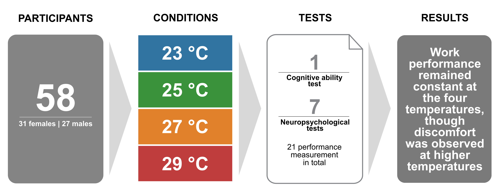

---
tags:
  - research
keywords: 
  - thermal comfort
  - productivity
  - air movement
  - energy consumption
  - retrofit
image: ./img/towp.jpg
description: This study investigates the impact of typical indoor temperatures on office work performance, finding no significant effect across a range of 23 to 29°C, thereby supporting the Maximum Adaptability Model and suggesting stable performance without the need for unnecessary cooling adjustments.
last_update:
  author: Federico Tartarini
---

# Do Typical Indoor Air Temperatures Affect Work Performance? No️

We experimentally investigated the impact of indoor temperature on office work performance. We conducted experiments with 58 participants, a large sample size compared to other studies, exposing them to temperatures of 23, 25, 27, and 29°C (~73, 77, 81, and 84°F) ❄️🌡 in a simulated tropical office environment for ~3 hours. These temperatures represent typical conditions in tropical buildings. During the experiment, we maintained constant relative humidity (50%), clothing insulation (0.5 clo), metabolic rate (1.1 MET), and airspeed (0.1 m/s).

 

To measure office work performance, we utilized one cognitive ability test and seven neuropsychological tests focusing on executive functions such as flexible thinking, working memory, and self-control. Our results showed that office work performance remained consistent across all tested temperatures, despite some participants experiencing thermal discomfort at the higher temperatures.

These findings support the Maximum Adaptability Model (also known as the extended-U model), which suggests that human performance remains relatively stable over a wide range of typical indoor thermal conditions. Based on our results, we advise against lowering air conditioning set points unnecessarily, as performance remained stable within the tested temperature range. This reflects participants’ preferences and tolerance, [consistent with a meta-analysis that found no relationship between indoor temperature and work performance](https://www.linkedin.com/pulse/meta-analysis-finds-relationship-between-indoor-office-schiavon/?trackingId=CSaQvB%2B8StGiHVa2iojL5w%3D%3D).

To promote transparency and reproducibility, we have made our [database and code openly available](https://datadryad.org/stash/dataset/doi:10.5061/dryad.1vhhmgr1x) for use in different climates to verify our results.

## Background 📚

Numerous studies have examined the effects of the thermal environment on cognitive functions and office work performance (OWP). Although there is a general agreement among scholars and practitioners that indoor thermal conditions influence cognitive function and OWP, consensus on the nature and strength of this relationship remains elusive.

Two main theoretical perspectives have emerged over more than 75 years of research: the inverted-U model and the Maximal Adaptability Model (MAM). The inverted-U model suggests a bell-shaped relationship between temperature and OWP, with optimal performance at a specific temperature (or thermal condition) and declines outside this range. In contrast, the MAM (or extended-U model) posits that maximum performance is maintained over a broader range of thermal conditions, only deteriorating beyond this range.

## Measuring Office Work Performance 📝

There is no universally accepted method for measuring the performance of knowledge workers, making the assessment more challenging compared to manual labor. In the field of indoor environmental quality (IEQ), neuropsychological testing and simulated work tasks are commonly used. We employed a battery of these neuropsychological tests and also included a cognitive ability test, which is considered the most valid and consistent predictor of job performance.

## Participants 👩‍🔬👨‍🔬

Our study included 58 adults (31 females and 27 males) who participated under controlled conditions. Participants wore a polo shirt, lightweight pants (chinos), and ankle-length socks, with a total clothing insulation of 0.5 clo, including the office chair.

## Conclusions 🏢

Allowing temperature fluctuation between 23 to 29°C in tropical buildings does not affect work performance, although the higher temperatures may cause discomfort. Previous work showed that a temperature of around 27°C can simultaneously provide thermal comfort and energy savings.

## Read the full article: 📖

[Porras-Salazar, J.A., Tartarini, F. and Schiavon, S., 2024. The effect of indoor temperature on work performance of fifty-eight people in a simulated office environment. *Building and Environment*, p.111813.](https://www.sciencedirect.com/science/article/pii/S0360132324006553)

## Acknowledgments 🙏

This research was funded by the Republic of Singapore’s National Research Foundation through a grant to the Berkeley Education Alliance for Research in Singapore (BEARS) for the Singapore-Berkeley Building Efficiency and Sustainability in the Tropics (SinBerBEST) Program. BEARS has been established by the University of California, Berkeley as a center for intellectual excellence in research and education in Singapore. The assistance of the following members of SinBerBEST is also acknowledged: Samuel Foo, Chee Hian Tan, Roslee Rahin, Edwin Goh, and Chris Soyza. Finally, we would like to extend special thanks to all participants and to Arulmani Natarajan and Giridharan Karunagaran, who served as the testbed control engineers.