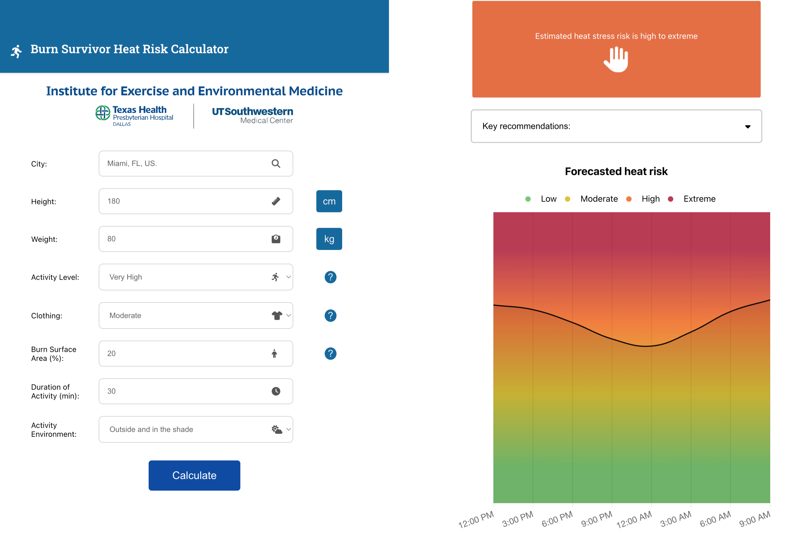

---
tags:
  - research
keywords: 
  - heat stress
  - burn survivors
  - web tool
  - heat risk
  - physical activity
  - burn injury
  - thermoregulation
  - heat-related illness
image: ./img/burn-tool.png
description: The "Burn Survivor Heat Risk Calculator" is a free online tool designed to provide personalised heat risk assessments for burn survivors during physical activity.
last_update:
  author: Federico Tartarini
---

# The "Burn Survivor Heat Risk Calculator": A Tool for Safe Physical Activity

**Burn survivors have unique challenges in regulating their body temperature** due to permanent impairments in their skin's ability to dissipate heat through sweating and blood flow. 
This can lead to a **heightened risk of heat-related illnesses** and increased perceived exertion during physical activity, potentially discouraging them from engaging in much-needed exercise. 

To address this critical issue, we have developed and validated a free online tool, the **"Burn Survivor Heat Risk Calculator" (www.bsrcalculator.org)**, designed to provide personalised heat risk assessments for burn survivors during physical activity.

 

## Development of the Heat Risk Calculator

The foundation of the calculator lies in a **modified two-node thermal physiological model**. 
We adapted this model to account for the **reduced sweating capacity** in burn-injured skin by adjusting the maximal skin wettedness value based on the **percentage of total body surface area (TBSA) affected by the burn**. 
This acknowledges that only the uninjured skin can effectively produce sweat for evaporative cooling, the primary mechanism for thermoregulation in hot environments.

The calculator requires users to input several key pieces of information:

* **User's location:** This is used to estimate dry-bulb air temperature (shaded), relative humidity, and wind velocity, obtained via a weather forecast data API. The tool also considers **sun exposure** to account for radiant heat gain during daylight hours.
* **Intensity of physical activity:** Users select from categories ranging from rest to very high, each corresponding to an estimated rate of metabolic heat production.
* **Duration of physical activity:** The anticipated length of the activity is a crucial factor in estimating core temperature changes.
* **Clothing:** Users select from simplified categories (very light to very heavy) that correspond to established clo values, a measure of thermal insulation provided by garments.
* **Body size:** The model incorporates user-inputted mass and height to estimate body surface area.
* **Size of burn injury:** Users input the percentage of their total body surface area that was burned, which directly influences the model's adjustment of maximal skin wettedness.

The calculator then processes these inputs to estimate the user's **core temperature change** and categorises their heat risk as either **low to moderate (change in core temperature < 1.7°C)** or **high to extreme (change in core temperature ≥ 1.7°C)**. 

Furthermore, the application provides a **20-hour forecasted heat risk** and offers recommendations, such as considering postponing activity or moving it indoors if the predicted risk is high to extreme.

## Validation of the Predictive Model

To assess the accuracy of the "Burn Survivor Heat Risk Calculator", the researchers compared its predictions against historical data from laboratory trials. 
These trials involved **134 adults with well-healed burn injuries (≥ 13% TBSA, ≥ 50% grafted)** and **157 healthy control participants with simulated burn injuries**. 
The simulated injuries involved covering predetermined percentages of body surface area with a vapor-impermeable material to impede sweat evaporation. 

Trials were conducted across a range of environmental conditions (25 to 39°C and 20 to 40% relative humidity) and exercise intensities (45 to 357 W/m²). 

The model inputs from these historical trials were used to predict the change in core temperature and the associated heat risk category. 
The results of the validation process were as follows:

*   The model achieved an **overall predictive accuracy of 85%** in categorising heat risk (low to moderate or high to extreme).
*   The **specificity was 85%**, indicating that the model correctly identified low to moderate risk in 85% of the cases where it was actually low to moderate.
*   The **sensitivity was 79%**, meaning the model correctly identified high to extreme risk in 79% of the cases where it was actually high to extreme.
*   The **negative predictive value was remarkably high at 98%**, suggesting a very low chance of experiencing a high to extreme core temperature increase when the model predicts a low to moderate risk.
*   The **positive predictive value was 27%**, indicating that when the model predicted a high to extreme risk, it was correct only 27% of the time, suggesting a tendency to overpredict risk in this category.

The researchers also found that the model appropriately predicted **greater increases in core temperature with larger burn injury sizes** across various environmental conditions. 
This highlights the model's ability to account for the physiological impact of burn injury on thermoregulation.

## Implications

The **Burn Survivor Heat Risk Calculator** offers a valuable tool for burn survivors and their caregivers to **proactively manage heat risk** during physical activity. 
By providing a personalised risk assessment, the tool can empower individuals to make informed decisions about when, where, and how intensely they can exercise safely, potentially promoting a more active lifestyle crucial for their long-term health. 
Given the increasing global temperatures and the frequency of heatwaves, such a tool is becoming increasingly important for this vulnerable population.

## Limitations

However, the researchers acknowledge several limitations:

* The validation data did not account for repeated measures from the same participant, which might modestly inflate the accuracy.
* While the binary risk prediction is good, the model's ability to precisely predict the actual elevation in core temperature (°C) is more variable.
* The model assumes a uniform resting core temperature, which may affect the accuracy for individuals with different baseline temperatures.
* The model focuses primarily on impairments in evaporative heat loss (sweating) and does not fully incorporate the impact of impaired cutaneous vasodilation in burn survivors, as its effect on dry heat exchange is still unclear.
* Wind speed data is obtained from weather APIs at a height that may differ from ground level, and the model does not account for convective airflow during activities like cycling.
* Different clothing combinations were not systematically tested during validation.
* The validation participants were not heat-acclimated, so the risk categorisation might overestimate risk for individuals regularly exposed to heat.

Despite these limitations, the **Burn Survivor Heat Risk Calculator** represents a significant step forward in providing burn survivors with a means to understand and mitigate their heat risk during physical activity. 
The tool's strong negative predictive value suggests it is reliable in identifying low-risk scenarios, offering confidence to individuals seeking to engage in a more physically active lifestyle. 

## Read the full article:

[McKenna, Z.J., Foster, J., Atkins, W.C., Gideon, E.A., Jay, O., Tartarini, F. and Crandall, C.G., 2025. Development and Validation of a Heat Risk Mitigation Tool for Burn Survivors. Medicine and science in sports and exercise.](https://journals.lww.com/acsm-msse/abstract/9900/development_and_validation_of_a_heat_risk.749.aspx)