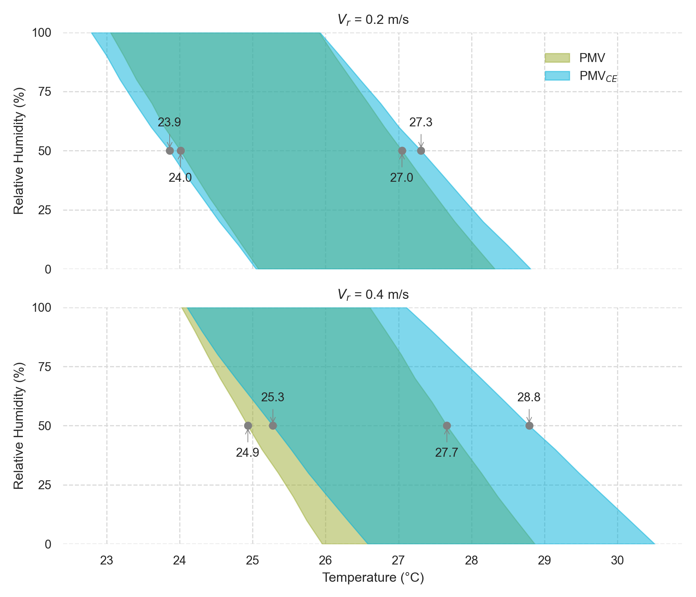
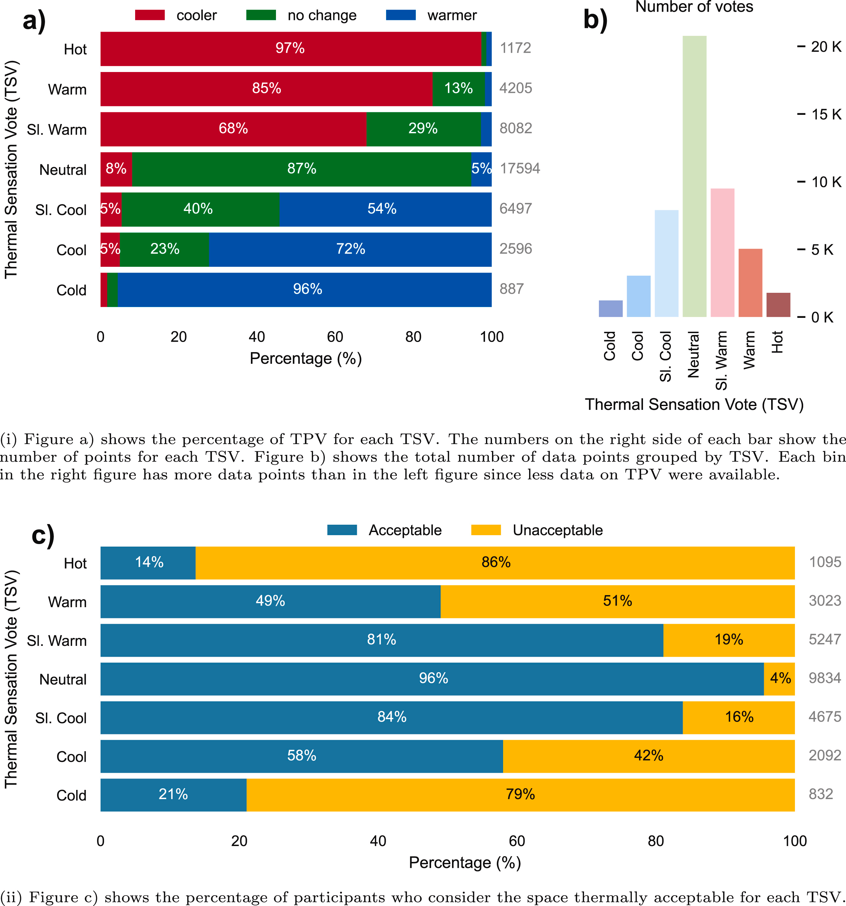
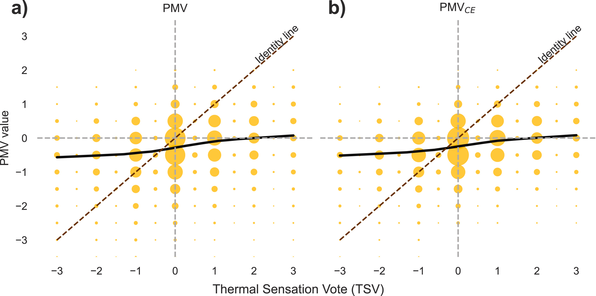
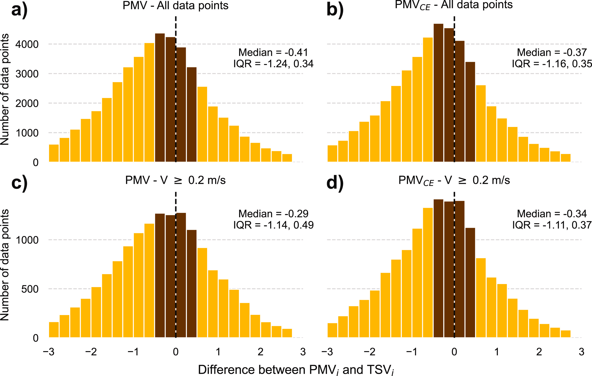
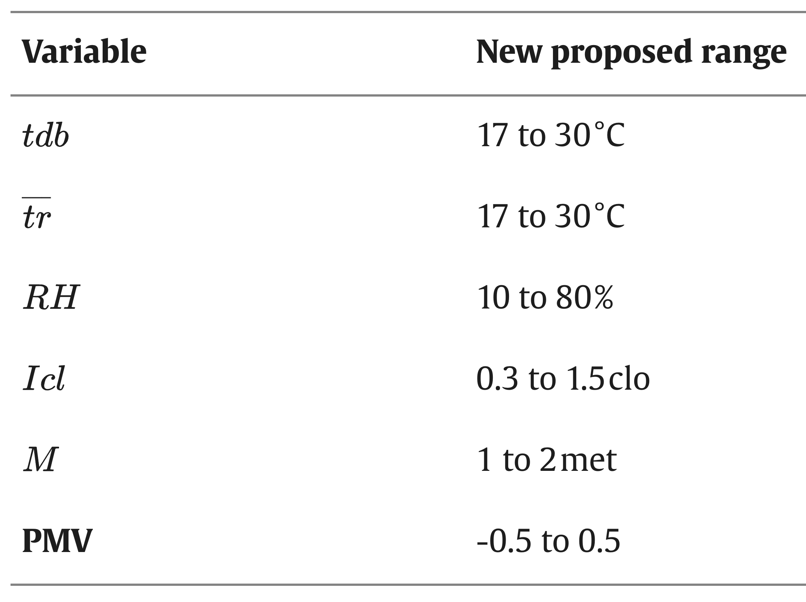

---
tags:
  - research
keywords: 
  - predicted mean vote
  - thermal sensation
  - thermal comfort
  - PMV
  - PMV-CE
  - ISO 7730
  - ASHRAE 55
  - thermal comfort standards
image: ./img/pmv-comparison-graphical-abstract.png
description: A paper comparing the accuracy of the PMV and PMV-CE models used in the ISO 7730:2005 and ASHRAE 55:2023 standards, respectively.
last_update:
  author: Federico Tartarini
---

# On the accuracy of ASHRAE and ISO PMV models
We have compared the accuracy of the Predicted Mean Vote (PMV) model used in the ISO 7730:2005 standard and the PMV model used in the ASHRAE 55:2023 standard (named here PMV-CE) in predicting thermal sensation. 

We used data from the ASHRAE Global Thermal Comfort Database II to evaluate the performance of these two models and we concluded that:
* Both PMV and PMV-CE models have low and similar prediction accuracy, correctly predicting thermal sensation only about one-third of the time.
* The PMV-CE model has a higher bias (i.e., is worse) than the PMV model in predicting thermal sensation, especially at relative air speeds ≥ 0.2 m/s.
* Both models have an accuracy lower than or equal to 5% when predicting 'warm', 'hot', or 'cold' thermal sensations, which is lower than random guessing (14%).
* We recommend limiting the applicability of both models to |PMV| ≤ 0.5, as a PMV value higher than 0.5 or lower than -0.5 only indicates that people's thermal sensation is on the 'warm' or 'cold' side, respectively, without the ability to distinguish between the different thermal sensation steps (cold, cool, slightly cool, slightly warm, warm, and hot)
* Assuming that individuals who feel 'slightly warm' or 'slightly cool' are thermally neutral leads to underestimating thermal discomfort.

## Background
Fanger developed the PMV model, which is now incorporated into the ISO 7730:2005 standard in its original form. The ASHRAE 55:2023 standard uses a modified version of the original model, the PMV-CE.

The two PMV formulations mainly differ when the relative air speed (Vr) value is higher than 0.1 m/s. Vr is not equal to the measured airspeed (V). According to both standards, V should be adjusted as a function of the metabolic rate.

The Figure below shows how the output of the two models differ using the same inputs (i.e., met = 1.2, and clo = 0.5). The PMV-CE models allow for higher temperatures.

 

## Objectives of the paper
Choosing between the PMV and PMV-CE is a source of confusion for researchers, educators, and practitioners worldwide since both models are widely used in guidelines and certification programs. For example, the WELL certification allows both compliance with ISO 7730 and ASHRAE 55 standards, even though the two models have different outputs under the same environmental and personal conditions.

In this paper, we compare the accuracy of the PMV and PMV-CE models used in the ISO 7730:2005 and ASHRAE 55:2023 standards, respectively. We used the TSV recorded in the ASHRAE Global Thermal Comfort Database II (DB). We aim to determine which PMV model is more accurate and the models’ applicability limits.

## Results
### ASHRAE Global Thermal Comfort Database II
The thermal sensation vote (TSV) dataset is unbalanced. Approximately 42% of all the entries have a TSV of ‘neutral’. While less than 3% of the total sample of participants reported to be either ‘hot’ or ‘cold’.

In thermal comfort research, it is generally assumed that people who are ‘slightly warm’ or ‘slightly cool’ are thermally neutral. However, 68 % of participants who were ‘slightly warm’ wanted to be ‘cooler’ and 54 % of participants who were ‘slightly cool’ wanted to be ‘warmer’. This finding challenges the above assumption, as shown in the Figure below.

 

### Comparison of PMV accuracy in predicting thermal sensation
The intended aim of the PMV model is not to accurately predict individual thermal responses from participants. Even if also used by Standard in single occupancy spaces, the PMV model was developed to predict the average thermal sensation of an undefined large group of occupants sharing the same environment. Hence, we plotted the PMV and PMV-CE values as a function of TSV in the Figure below, and we plotted a LOcally WEighted Scatterplot Smoothing (LOWESS) curve. The curve, in the Figure, is calculated using the individual data and not the binned data. We only binned the data to aid the visualization of a large dataset.

The intercept for the PMV is -0.27 and for the PMV-CE is -0.24 which means that the model has a bias of less than one-quarter of a thermal sensation interval. However, both PMV formulations always under-predict the thermal sensation of people who reported to be on the extremes of the TSV.

 

### Models overall bias
We subtracted the PMV and PMV CE values from the thermal sensation vote (TSV). These differences, also known as bias, quantify the success of the model in predicting TSV. If the PMV or PMV CE formulations are bias-free, the distribution of any batch derived from these differences would have a mean value that is zero. The standard deviation would reflect the combined effect of the people’s differences, any errors in the model formulation or in the data collection method (accuracy or precision of the instrumentation used). This is a similar assumption to the one used by the PMV model, which ignores individual differences and calculates the average thermal sensation of a ‘typical’ average person.

Overall, both the PMV and PMV-CE models have a median bias lower than half of a thermal sensation interval. When including only the data with Vr >= 0.2 m/s the median bias of the PMV model reduces to -0.29 from -0.41, meaning that at higher speed the PMV model improves. The median bias for the PMV-CE also decreases to -0.34 from -0.37 but it is higher than the one for the PMV.

 

## Implications for the ASHRAE 55:2023 and ISO 7730:2005 standards and PMV users
* Researchers, educators, and practitioners worldwide may wonder which model they should use. The PMV-CE is more complex and computationally intensive to run, while not being more accurate than the original PMV model. Hence, we suggest researchers should calculate the PMV values according to the ISO 7730:2005 standards.
* The low prediction accuracy of both model formulations, along with the lack of data at the extremes of their applicability limits, suggests that these limits should be reconsidered. Based on our results, we recommend restricting the use of the PMV only to absolute values below 0.5 (|PMV| ≤ 0.5). In other words, we only recommend using it to determine whether an environment may be deemed thermally neutral by a large group of occupants.

 

* We also recommend restricting the ranges on both environmental and personal factors set by both ASHRAE 55:2023 and ISO 7730:2005 standards.
* The TSV is ambiguous and does not allow determining if an action should be taken to increase the participant’s thermal comfort. Assuming that people who are ‘slightly warm’ or ‘slightly cool’ are thermally neutral leads to undercounting thermal discomfort in our dataset, which is not a valid assumption. We recommend the use of the thermal preference scale to determine how people perceive their thermal environment. This scale more clearly allows an HVAC system to decide whether to change or not the thermal environment.
* Finally, we would like to highlight that the current definition of the PMV model which states that the model aims “…to predict the average thermal sensation of a large group of occupants” is ambiguous. Both the ASHRAE 55:2023 and ISO 7730:2005 standards should clarify the minimum number of occupants required to use the PMV model. For example, can it be used for a space with only one occupant?

## Read the full article:

Federico Tartarini, Stefano Schiavon, Comparative analysis of PMV Models accuracy implemented in the ISO 7730:2005 and ASHRAE 55:2023, Building and Environment,
https://doi.org/10.1016/j.buildenv.2025.112766 (open access)
