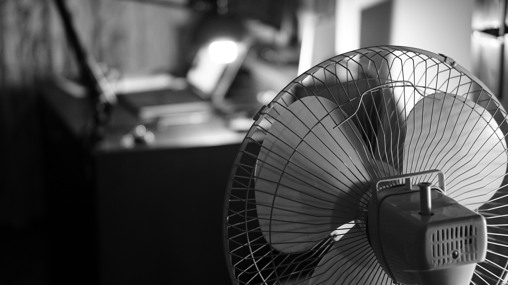

---
tags:
  - research
keywords:
  - heat stress
  - cooling strategies
  - climate change
  - electric fans
  - air conditioning
  - energy efficiency
  - moving the air
image: ./img/fan.jpg
description: A new approach to cooling during extreme heat events
last_update:
  author: Federico Tartarini
---

# Fan-First: A Sustainable Cooling Strategy for Heat-Health Protection

In our recently published article in the Medical Journal of Australia, we introduce the concept of "fan-first heat-health protection" - an approach that challenges our over-reliance on air conditioning during hot weather. 
**As global temperatures rise due to climate change, we urgently need affordable, energy-efficient cooling solutions that can protect health while reducing environmental impact.**

Electric fans use only about 3% of the energy required by air conditioning and cost much less to purchase and operate. 
Our research shows that fans effectively reduce heat stress by increasing comfort, reducing cardiovascular strain, and limiting core temperature rise in most hot conditions. 
**The fan-first approach recommends using electric fans as temperatures begin to rise indoors, and only turning on air conditioning when indoor temperatures reach around 27°C.** 
This simple change could reduce electricity demand and greenhouse gas emissions from cooling by more than 70% in a typical year in Australia!

 

Photo by <a href="https://unsplash.com/@igorbumba?utm_content=creditCopyText&utm_medium=referral&utm_source=unsplash">Igor Bumba</a> on <a href="https://unsplash.com/photos/a-black-and-white-photo-of-a-fan-80uUSTIUQMc?utm_content=creditCopyText&utm_medium=referral&utm_source=unsplash">Unsplash</a>

Contrary to older public health guidance, our research demonstrates that fans are safe to use at much higher temperatures than previously thought. 
**Electric fans can be safely used up to 39°C for young healthy adults, 38°C for older adults, and 37°C for older adults taking certain medications.** 
Above these thresholds, fans should be switched off as they may worsen heat stress. 
Combining fans with other strategies like wetting the skin can provide additional cooling during extreme heat.

For those on limited incomes who cannot afford air conditioning or are concerned about energy costs, electric fans offer an accessible alternative that can effectively protect health in most conditions. 
For those with air conditioning, the fan-first approach means setting the thermostat higher (around 27°C) and using fans to maintain comfort - significantly reducing energy consumption and costs without compromising well-being. 
**As we face more frequent and intense heatwaves, this approach offers a practical way to stay cool while building community resilience to extreme heat.**

## Read the full article:

[Bone, A., Tartarini, F., & Jay, O. (2025). Fan-first heat-health protection. Medical Journal of Australia.](https://onlinelibrary.wiley.com/doi/10.5694/mja2.52662)
      