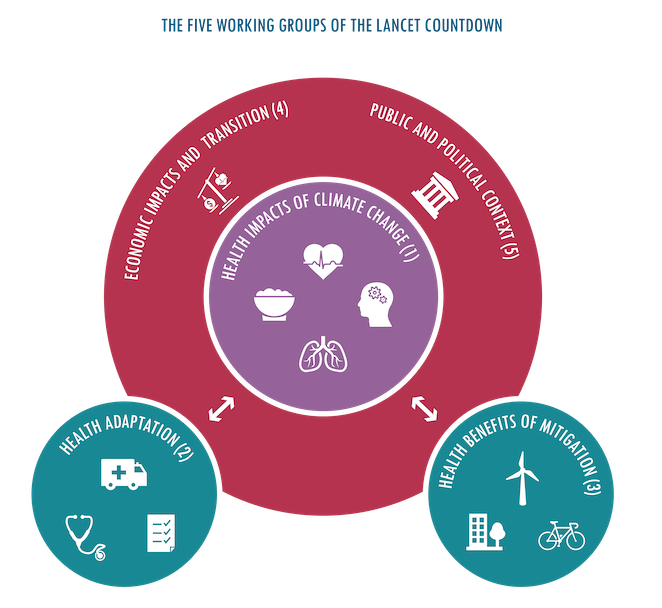

---
tags:
  - research
keywords:
  - climate change
  - heatwaves
  - Lancet Countdown
  - heat exposure
  - vulnerable populations
  - public health
image: ./img/25-global-report-lancet.png
description: A summary of the 2025 Global report of the Lancet Countdown, highlighting the increased heatwave exposure for vulnerable populations.
last_update:
  author: Federico Tartarini
---

# The 2025 Report of the Lancet Countdown: Climate Change Action Offers a Lifeline

In the 2025 global report of the *Lancet Countdown on health and climate change*, we provide a comprehensive assessment of the evolving relationship between climate and health.
**The report delivers a stark warning: delays in taking climate change action are resulting in millions of avoidable deaths every year, while fossil fuel dependence and rising emissions are pushing health threats to unprecedented levels.** 
However, it also emphasizes that transitioning to clean energy and scaling up adaptation efforts can still offer a lifeline for global health. 
The report covers 57 different indicators, grouped into five working groups as shown in the figure below. 

 

The five working groups of the Lancet Countdown

## My Contribution: Exposure of Vulnerable Populations to Heatwaves (Indicator 1.1.1)

My specific contribution focused on quantifying the growing exposure of our most vulnerable populations to extreme heat.
Infants and older adults are particularly vulnerable to the adverse health effects of heat exposure. For Indicator 1.1.1, we tracked the number of heatwave days and the exposure of these specific demographics (infants under 1 year and adults over 65 years) to extreme heat.

Our analysis revealed several alarming trends regarding vulnerable populations:
* **Record-breaking exposure increases:** In 2024, infants younger than 1 year and people older than 65 years experienced, on average, 389% and 304% more days of heatwaves per person, respectively, compared to the 1986–2005 baseline.
* **The undeniable role of climate change:** We contrasted the actual number of heatwave days people faced from 2020 to 2024 with a counterfactual scenario assuming no human-caused global heating. We found that globally, 84% of the heatwave days populations were exposed to annually during this period would not have occurred without climate change.

## Broader Highlights from the 2025 Report

Beyond heatwave exposure, the global report outlines severe climate-driven impacts across multiple dimensions of human health:
* **Heat-Related Mortality:** Globally, heat-related deaths have increased by 23% compared to the 1990s, now averaging approximately 546,000 deaths annually.
* **Loss of Labor Capacity:** Heat exposure led to the loss of 640 billion potential labor hours globally in 2024, an astonishing 98% increase above the 1990–1999 average. This translates to potential income losses of US$1.09 trillion, disproportionately affecting agricultural workers in low and medium HDI countries.
* **Food and Water Insecurity:** Worsening climate extremes are exacerbating the global food crisis. Higher heatwave exposure and increased drought months in 2023 were associated with 123.7 million more people experiencing moderate or severe food insecurity.
* **Air Pollution:** The failure to transition to clean energy sources led to an estimated 2.52 million deaths from fossil fuel-derived outdoor air pollution in 2022.

## Moving Forward: The Need for Adaptation and Mitigation

The 2025 Lancet Countdown report underscores that climate adaptation will ultimately fail without urgent mitigation. 
We must advance simultaneous efforts to reduce greenhouse gas emissions and build health system resilience. 
Expanding urban green spaces to reduce heat exposure, promoting active travel, and accelerating the transition to renewable energy are critical steps to protect the health and survival of populations worldwide.

## Read the full article:

[Romanello, M., Walawender, M., Hsu, S. C., et al. (2025). The 2025 report of the Lancet Countdown on health and climate change: Climate change action offers a lifeline. The Lancet.](https://lancetcountdown.org/2025-report/)