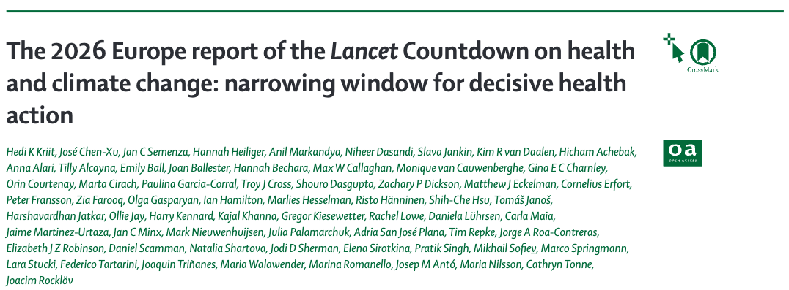
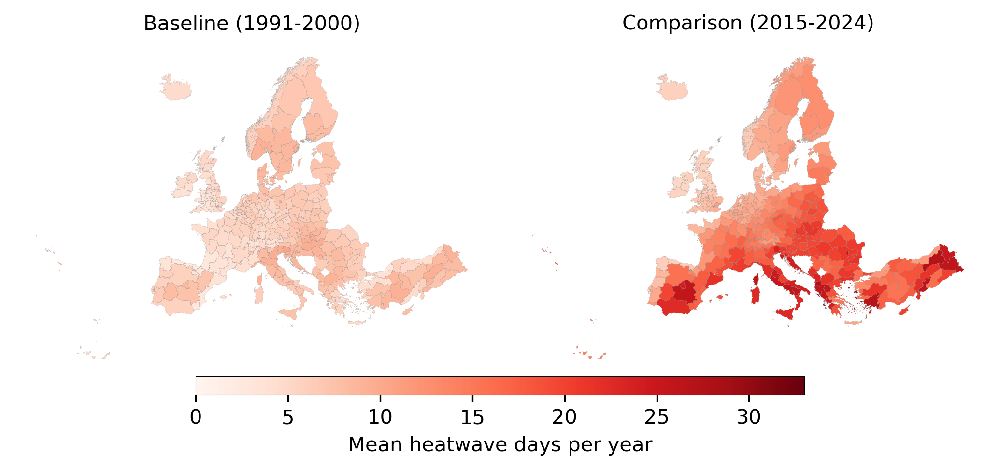

---
tags:
  - research
keywords:
  - climate change
  - heatwaves
  - Lancet Countdown
  - heat exposure
  - public health
  - climate adaptation
image: ./img/26-eu-report.png
description: A summary of the 2026 Europe report of the Lancet Countdown, highlighting the increased heatwave exposure for at-risk populations.
last_update:
  author: Federico Tartarini
---

# The 2026 Europe Report of the Lancet Countdown: Narrowing Window for Action

In the newly published third iteration of the *[Lancet Countdown on health and climate change in Europe](https://doi.org/10.1016/S2468-2667(26)00025-3)*, we systematically track the health effects of climate change, adaptation actions, and societal engagement across the continent.
**The data reveals a stark reality: Europe is experiencing a marked increase in both direct and indirect negative health impacts due to climate change, demanding urgent and decisive health action.** 

 

EU Report paper

## My Contribution: Exposure of At-Risk Populations to Heatwaves (Indicator 1.1.1)

While I contributed broadly to the report, my specific research focused on evaluating how extreme heat events are increasingly affecting our most vulnerable populations.
The summer of 2024 was the hottest on record in Europe, bringing substantial bouts of extreme heat to various regions. 
Heatwaves do not affect everyone equally; they disproportionately impact highly vulnerable groups, particularly infants (under 1 year of age) and older adults (65 years and older).

Through our analysis for Indicator 1.1.1, we quantified this exposure and found alarming trends:
* **Record-breaking exposure:** In 2024, these at-risk populations experienced an unprecedented 2.3 billion person-days of heatwave exposure. This surpasses the previous maximum of 2.1 billion person-days recorded just a year prior in 2023.
* **A massive decadal jump:** When comparing the most recent decade (2015–2024) to our historical baseline (1991–2000), average heatwave exposure surged by 254%. In absolute terms, this represents a jump from 460 million person-days to 1.63 billion person-days.
* **The driving factors:** This dramatic rise is fueled by a dangerous combination of two factors: shifting demographics (an aging population means more people fall into the at-risk group) and a 129% increase in the actual frequency of heatwave days.
* **Regional hotspots:** Eastern Europe emerged as a critical hotspot. In 2024, older individuals in this region faced the highest average exposure, enduring 34.5 heatwave days per person.

The Figure below shows the mean annual number of heatwave days experienced by vulnerable populations (elderly individuals and infants) across each Nomenclature of Territorial Units for Statistics (NUTS) region during both the baseline period (1991-2000) and the comparison period (2015-2024).

 

Mean heatwave days per year for at-risk populations across European regions

## Broader Highlights from the 2026 Report

Beyond heatwave exposure, the report outlines several other critical indicators of how climate change is reshaping health in Europe:
* **Heat-Related Mortality:** Heat-related deaths have increased in 99.6% of monitored European regions, with an overall mean annual increase of 52 deaths per million inhabitants (2015–2024 compared to 1991–2000).
* **Infectious Diseases:** Rising temperatures are expanding the geographical range of disease vectors. For instance, the transmission suitability for the dengue virus increased by 297% across Europe in 2015–2024 compared to 1981–2010.
* **Food Insecurity:** Heatwaves and droughts led to an additional 1 million people experiencing moderate to severe food insecurity in Europe in 2023. Low-income households are particularly vulnerable to these climate-induced shocks.
* **A Decline in Engagement:** Despite the growing scientific evidence, there has been a concerning decline in individual, political, corporate, and media engagement regarding the climate change and health nexus in recent years.

## Moving Forward: The Need for Adaptation

While Europe leads in many aspects of the transition to a healthier future—such as increasing renewable energy shares—progress must be vastly accelerated. 
The findings from Indicator 1.1.1 and the broader report underscore that current mitigation policies are not enough. 
We urgently need to scale up local and national adaptation strategies, ranging from improved heat-health early warning systems to targeted interventions that protect our most vulnerable demographics during extreme weather events.

## Read the full article:

[Kriit, H. K., Chen-Xu, J., Semenza, J. C., ... Tartarini, F., et al. (2026). The 2026 Europe report of the Lancet Countdown on health and climate change: narrowing window for decisive health action. The Lancet Public Health.](https://doi.org/10.1016/S2468-2667(26)00025-3)