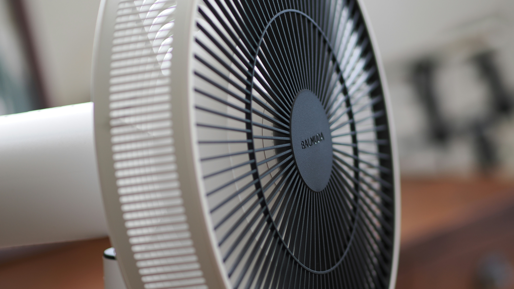
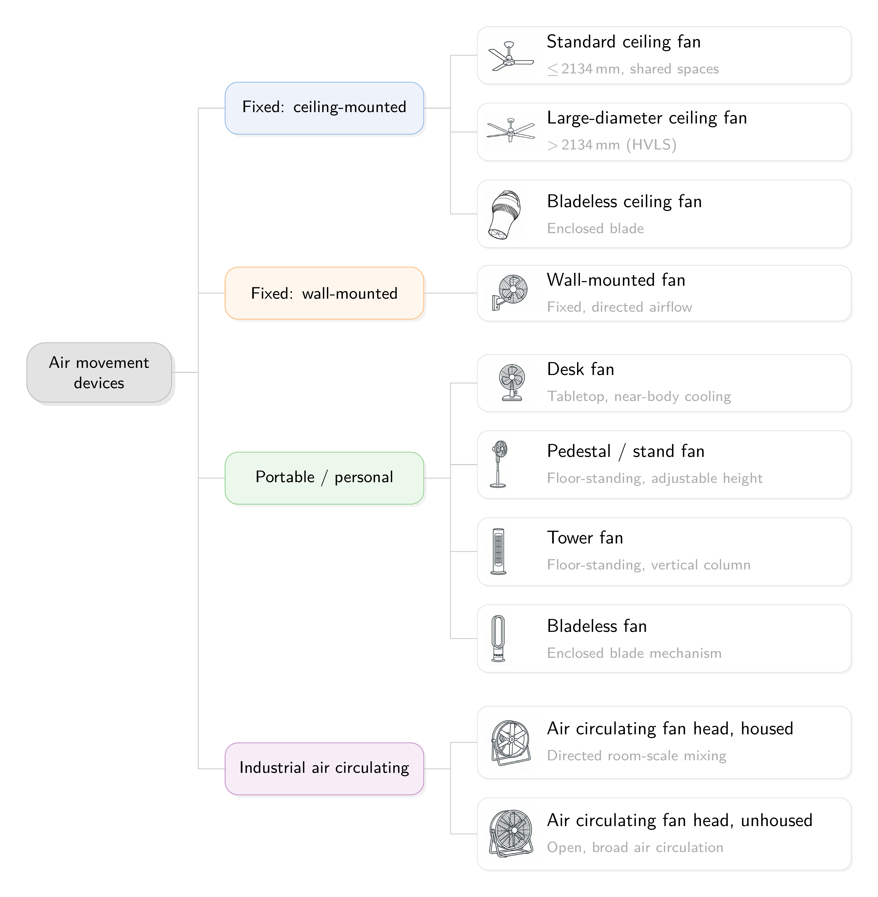

---
tags:
  - research
keywords:
  - fan-first cooling
  - air movement
  - thermal comfort
  - energy efficiency
  - indoor air quality
  - ceiling fans
image: ./img/26-10-fan-first.jpg
description: Ten questions on using air movement, not air conditioning, as the primary cooling strategy
last_update:
  author: Federico Tartarini
---

# Fan-First: Why Air Movement Should Be Your First Cooling Strategy, Not Your Last

Cooling demand is rapidly growing. Installed cooling capacity is projected to roughly triple by 2050, and buildings already generate an estimated 4.1 billion tonnes of CO₂-equivalent a year just to keep us cool. This is more than India's entire annual CO₂ emissions (~3.0 billion tonnes, the world's third-largest emitter). Cooling alone now outpaces one of the world's biggest economies.

**In our new "10 Questions" article in *Building and Environment*, we argue for flipping the cooling status quo: move air first, and only cool the air when you need to.**
Raising air speed lets you feel just as thermally comfortable at a higher temperature as still air does at a lower one, achieving the same cooling for a fraction of the energy and cost.

**Fan-first** cooling, as we call it, prioritises air movement using electric fans (ceiling, desk, pedestal) as the primary comfort strategy, and rely on mechanical cooling only when fans alone aren't enough. The paper works through ten open questions on making this a reality, and sets a research agenda for air movement for the years ahead. The questions range from selecting the right device to the cultural barriers that still hold adoption back.

 

Photo by <a href="https://unsplash.com/@kazz_aoki?utm_source=unsplash&utm_medium=referral&utm_content=creditCopyText">Kazuyuki AOKI</a> on <a href="https://unsplash.com/photos/a-white-fan-sitting-on-top-of-a-wooden-table-QNmT3wjZIBA?utm_source=unsplash&utm_medium=referral&utm_content=creditCopyText">Unsplash</a>

## Key Findings

- **Comfort at higher temperatures:** fan-first strategies maintain thermal comfort at indoor temperatures of 27–30°C, well above conventional air-conditioning setpoints, without sacrificing comfort.
- **Energy savings:** simple fan automation cuts building cooling energy use by 20–40%.
- **Lower construction costs, not just lower running costs:** zone-level HVAC construction costs can drop by up to 35% when fans handle part of the cooling load.
- **Better air quality:** ceiling fans reduce short-range aerosol exposure by 54–77% by improving room-scale mixing, countering the common assumption that fans "spread" pathogens.
- **Safe to use in hot conditions:** fan safety depends on humidity and individual factors (age, health, hydration), not on air temperature alone, so a blanket "turn fans off above 35°C" rule is too simple.

## Types of Fans

There are several types of fans available, and the right choice depends on the space and the level of individual control needed.

 

*A taxonomy of the different fan types (ceiling, pedestal, tower, desk, personal/wearable)*

## The Ten Questions

The ten questions are grouped into four themes:

**Choosing and evaluating devices**
1. Fan selection: how to choose air movement devices for efficiency and design goals
2. Economics: the cost and environmental trade-offs of going fan-first
3. Measurement: how to actually measure fan-induced air speed in occupied rooms

**Predicting thermal comfort**
4. Modelling: are today's thermal-comfort models good enough under elevated air movement?
5. Control: the most cost-effective ways to automate fans for comfort and energy savings

**Health, safety, and the built environment around the fan**
6. Air quality: how air movement affects pollutant and pathogen exposure indoors
7. Lighting: how fans interact with lighting, and how to avoid glare and flicker issues
8. Safety: the real hazards of air movement and what causes them
9. Thermal stress: the environmental limits that keep people safe, not just comfortable

**Getting people to actually use them**
10. Culture: the climate, cultural, and behavioural factors that shape fan acceptance

## Practical Recommendations

- Treat fans as the default comfort strategy in mechanically conditioned, mixed-mode, and naturally ventilated buildings alike, not a fallback for when AC is unavailable.
- Raise cooling setpoints when fans are running: 27–30°C with elevated air movement is not a compromise, it can feel as comfortable as a much cooler, still-air room set several degrees lower. Try it at home!
- Don't assume elevated air movement worsens indoor air quality: in many cases, better mixing helps.
- Match the fan to the space: ceiling fans for shared areas, desk/pedestal fans where individual control matters.
- Size and automate fan control around cost and comfort: control strategy is where much of the energy saving comes from.

**Fans are one of the cheapest, most scalable tools we have for cooling buildings sustainably. They are available now and they can help us meet the growing cooling demand without worsening climate change. The barrier isn't the evidence, it's adoption.**

## Read the full article:

[Tartarini, F., Chong, A., Cheung, T., Jay, O., Kent, M., Li, J., Lipczynska, A., Mahdavi, A., Pasut, W., Popiolek, Z., Raftery, P., Ravanelli, N., Taber, C., Tham, K.W., Wilkins, A., & Schiavon, S. (2026). Ten Questions on Air Movement as a Primary Cooling Strategy: "Fan-First" Cooling. *Building and Environment*.](https://www.sciencedirect.com/science/article/pii/S036013232601019X)
