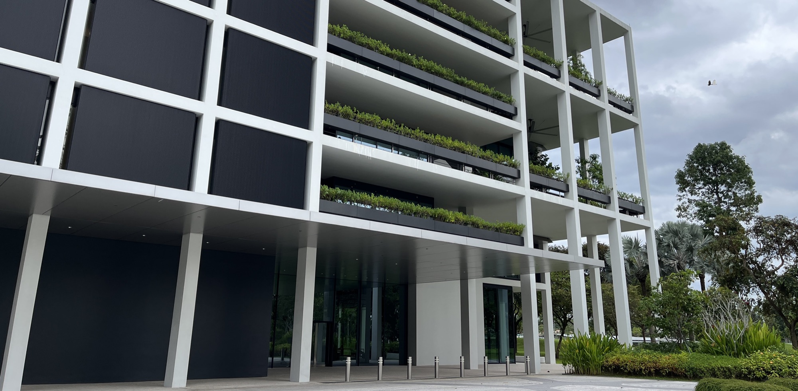

---
tags:
  - research
keywords:
  - mixed-mode ventilation
  - natural ventilation
  - elevated air movement
  - tropical climate
  - thermal comfort
  - energy efficiency
  - fans
image: ./img/26-09-mixed-mode.jpg
description: Fan-assisted natural ventilation works in more tropical cities than previously thought
last_update:
  author: Federico Tartarini
---

# Mixed-Mode Ventilation in the Tropics Works Better Than We Thought, If You Add a Fan

Natural ventilation is usually written off in hot-humid climates: open a window in Singapore or Mumbai and conventional wisdom says you'll just let in more heat and moisture. **Our new paper in *Energy and Buildings* shows that conventional wisdom is too pessimistic, because it ignores the cooling effect of air movement from fans.**

With Kazuki Horikoshi and Adrian Chong (National University of Singapore), we ran annual building energy simulations for a standardized apartment building across 20 tropical cities, testing automated window control against six outdoor "switch-over" temperatures and six levels of fan-generated air speed (up to 2.0 m/s), with thermal comfort assessed across 66 combinations of clothing and activity level.

 

The GEAR: Kajima Lab, Singapore

## Key Findings

- **Elevated air movement expands where natural ventilation works:** cities previously classified as having near-zero natural ventilation potential in hot-humid conditions become viable once fan-induced air speed is accounted for.
- **An outdoor switch-over temperature around 29°C is optimal for most tropical cities:** windows should open below this threshold and close above it, balancing comfort gains against the risk of letting in hot air.
- **Some cities tolerate higher thresholds (up to 31°C):** Bengaluru, Hyderabad, and Rio de Janeiro can push the switch-over point higher because their hot hours are often low-humidity ("low-enthalpy"), so the same temperature feels less of a burden indoors.
- **Singapore case study:** at its optimal 29°C switch-over point, naturally ventilated rooms stayed comfortable for 73.3% of natural-ventilation hours (1,828 of 2,494 waking hours), across the 66 personal-factor combinations tested.
- **The fan speed you need changes through the day:** required air speed rises as outdoor temperature climbs toward midday/afternoon, meaning a fixed fan setting under-delivers at the hottest times. Dynamic, variable-speed fan control performs better than a single fixed speed.

## Practical Recommendations

- Don't rule out natural or mixed-mode ventilation in hot-humid climates based on temperature alone, factor in fan-assisted air movement before dismissing it.
- Set window/vent control logic around a switch-over outdoor temperature near 29°C as a starting point, and tune it higher in climates with pronounced dry hot periods.
- Pair automated natural ventilation control with variable-speed fans rather than a single fixed speed, since the air speed needed for comfort shifts across the day.
- Consider humidity (enthalpy), not just dry-bulb temperature, when deciding switch-over thresholds, since two cities at the same temperature can have very different comfort outcomes depending on moisture content.

**Mixed-mode ventilation with fans is a more powerful, more widely applicable energy-saving strategy for tropical buildings than earlier assessments suggested.**

## Read the full article:

[Horikoshi, K., Tartarini, F., & Chong, A. (2026). Reassessing mixed-mode ventilation in tropical climates with elevated air movement. *Energy and Buildings*, 372, 118311.](https://doi.org/10.1016/j.enbuild.2026.118311)
