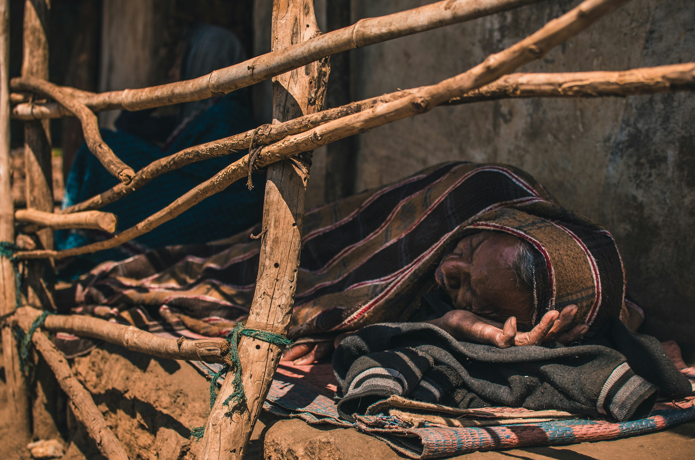

---
tags:
  - research
keywords:
  - night-time heat
  - ageing
  - neurodegeneration
  - dementia
  - sleep
  - climate change
  - older adults
image: ./img/26-09-nighttime.jpg
description: A perspective on why night-time heat is an under-recognised threat to brain health in ageing and neurodegenerative disease
last_update:
  author: Federico Tartarini
---

# Night-Time Heat Stress, Ageing and Neurodegeneration — The Next HOT Topic

Population ageing and climate change are converging on a threat that gets little attention: what hot nights do to the ageing brain. **Our new narrative review in *Current Treatment Options in Neurology* argues that night-time heat deserves far more attention as a driver of dementia risk than daytime heat has so far received.**

 

Photo by <a href="https://unsplash.com/@35mmlife?utm_source=unsplash&utm_medium=referral&utm_content=creditCopyText">Parij Borgohain</a> on <a href="https://unsplash.com/photos/man-lying-on-floor-covered-with-pinstriped-blanket-Oe6L4l9kdNo?utm_source=unsplash&utm_medium=referral&utm_content=creditCopyText">Unsplash</a>

By 2050 the global population aged 60+ will reach 2.1 billion, nearly double 2020 levels, and dementia already affects more than 55 million people worldwide. At the same time, adults 65+ are already experiencing 96% more heatwave days than in 1986–2005, and heat extremes are becoming more frequent and less predictable. Older adults, and especially people living with or at risk of dementia, are uniquely vulnerable: ageing and neurodegeneration impair thermoregulation, sleep, vascular and inflammatory homeostasis, and the ability to even recognise and respond to heat stress.

## Why Older Adults Are More Vulnerable

Heat vulnerability compounds across several domains:

- **Physiological:** reduced sweating capacity and skin blood flow, declines in cardiovascular and autonomic function, and diminished thirst perception all impair the body's ability to dissipate heat and stay hydrated.
- **Pathological:** cognitive impairment and dementia reduce risk perception and the ability to use cooling devices, seek help, or communicate discomfort; chronic conditions (cardiovascular disease, diabetes, chronic kidney disease) lower physiological reserve.
- **Medication effects:** anticholinergic drugs, non-selective beta-blockers, and dopaminergic medications — common in people at higher dementia risk — can raise core temperature and suppress sweating, and are linked to 16–37% higher heat-related hospitalisation risk.
- **Behavioural/functional:** mobility limitations and social isolation reduce the ability to reach cooler spaces, adjust the environment, or get help in time.

## What the Epidemiological Evidence Shows

We reviewed epidemiological studies from Germany, China, the UK, Spain, the US, and South Korea linking ambient heat to dementia-related mortality, hospitalisation, emergency-department visits, and (in a small number of studies) incident dementia. The evidence consistently shows heat as an acute trigger: heatwaves and extreme heat days are associated with higher dementia-related mortality (e.g. +75% during heatwaves in a Chinese cohort) and increased hospital admissions. Several studies specifically implicate hot nights: one Chinese study found hot-night excess carried a *greater* attributable mortality burden than hot-day excess.

But the evidence has real limits: most studies rely on outdoor temperature as a proxy (which poorly reflects actual bedroom conditions), mainly capture people who already have dementia rather than whether heat contributes to disease onset, and come overwhelmingly from high-income, temperate settings. Only one prospective study to date suggests heat may accelerate incident dementia — evidence for other neurodegenerative diseases like Parkinson's remains sparse.

## A Proposed Pathway: Hot Nights → Sleep Disruption → Neurodegeneration

The paper's central contribution is a mechanistic pathway linking night-time heat to neurodegeneration through sleep:

- Sleep onset and maintenance depend on the body's natural nighttime drop in core temperature — a process that elevated night-time heat directly disrupts.
- This reduces sleep efficiency and, critically, undermines **slow-wave sleep**, the deepest sleep stage responsible for memory consolidation and glymphatic clearance of neurotoxic proteins (including beta-amyloid and tau) implicated in Alzheimer's disease.
- At the cellular level, chronic or extreme heat can overwhelm the heat-shock protein chaperone network that normally helps restrain misfolded protein accumulation, while also triggering neuroinflammatory pathways — creating a potentially self-reinforcing cycle.
- Animal studies of Alzheimer's models suggest this relationship may be U-shaped: modest warming can be protective, but sustained heat exposure worsens amyloid and tau pathology and cognitive decline.

Large population studies support the sleep link: rising night-time temperatures shorten sleep duration globally, with older adults losing more than twice as much sleep per degree of warming as younger adults, and hot nights are independently associated with excess mortality across most world regions.

## Clinical and Policy Implications

The review sets out practical steps clinicians and policymakers can take now, even though direct proof of the pathway is still incomplete:

- **Treat night-time heat as a seasonal risk to screen for**, with vulnerability tracked by functional status (mobility, cognitive impairment, dependency) rather than age alone.
- **Review medications before the warm season** — particularly anticholinergics, non-selective beta-blockers, and dopaminergic drugs that impair heat tolerance.
- **Match cooling strategies to the patient and context**: air-conditioning is most reliable, but where unavailable, daytime shading, night-time ventilation, lighter bedding and sleepwear, and relocating to the coolest room all help. Fans are useful when sweat can evaporate, but lose effectiveness near skin temperature (~40°C) or when sweating is impaired.
- **Manage hydration actively** rather than relying on thirst, which is often unreliable in people with cognitive impairment.
- **Address structural determinants**, since many drivers of a hot bedroom — housing quality, insulation, urban tree canopy, access to cooling — sit outside individual control and require housing and urban-cooling policy, not just clinical advice.

**As nights continue to warm, protecting sleep may be one of the more tractable ways to defend the ageing brain** — but testing this pathway properly will require studies that track heat, sleep, and cognition together, using bedroom-level exposure data rather than outdoor-temperature proxies.

## Read the Full Article

[Kong, S. D., Tartarini, F., Mavros, Y., Schikowski, T., & Naismith, S. L. (2026). Night-Time Heat Stress, Ageing and Neurodegeneration - The Next HOT Topic. *Current Treatment Options in Neurology*, 28(1), 31. https://doi.org/10.1007/s11940-026-00891-9](https://doi.org/10.1007/s11940-026-00891-9)
