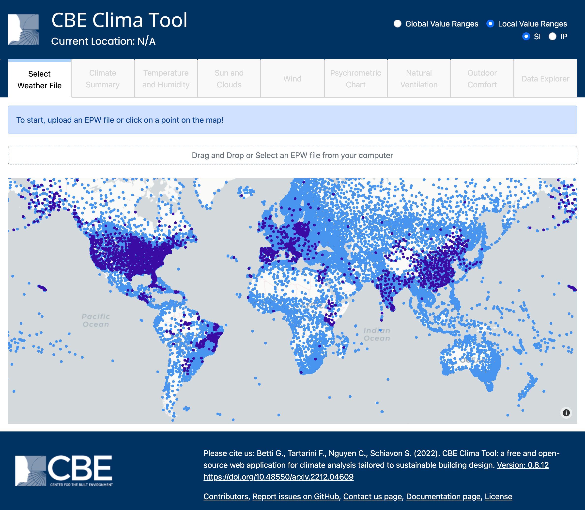

---
tags:
  - tool
keywords: 
  - climate analysis
  - passive design
image: ./img/clima.png
description: This article describes the CBE Clima Tool (Clima) a free and open-source web application that provides a series of interactive visualization
last_update:
  author: Federico Tartarini
---

# CBE Clima Tool

> A web application for climate analysis and sustainable building design

:::info

The CBE Clima Tool can be accessed at this [URL](https://clima.cbe.berkeley.edu). 
You can also find more information about the tool, its features, and its documentation at this [URL](https://cbe-berkeley.gitbook.io/clima).

:::

The design of buildings that are attuned to the local climatic conditions is key to enhancing comfort, energy efficiency, and environmental sustainability. 
However, accessing, visualizing, and analyzing local climate data can be challenging for architects, engineers, students, and educators. 
To facilitate this process we developed the CBE Clima Tool. 

<iframe width="100%" height="350" class="youtube-video" src="https://www.youtube.com/embed/VJ_wOHadVdw?si=fO_gaJd37ytkN93e" title="YouTube video player" frameborder="0" allow="accelerometer; autoplay; clipboard-write; encrypted-media; gyroscope; picture-in-picture; web-share" allowfullscreen></iframe>

This free and open-source web application offers easy access to over 30,000 publicly available weather files in EPW format and creates interactive visualizations of the climatic variables therein contained.
Additionally, CBE Clima can also analyze any valid EPW file and calculate many additional parameters, like sun diagrams, indoor and outdoor thermal comfort indices and natural ventilation potential among others.

 

The CBE Clima Tool has several features that make it a valuable asset for professionals, researchers and students seeking to advance sustainable building design practices. Here are some of them:

**Universal Accessibility**: It is web-based, providing users worldwide with the ability to rapidly and reliably analyze and visualize climate data. This feature facilitates collaboration and knowledge exchange.

**User-Friendly Interface**: The user interface is characterized by its ease of use and interactivity. Users can generate high-quality graphical representations of climate data and download them in an editable format. This user-friendly approach greatly enhances communication of climate-adapted building design concepts.

**Cross-Platform Compatibility**: The web-based nature of our tool eliminates the need for local installations and ensures cross-platform compatibility. This accessibility ensures that users can use it regardless of their preferred operating system, further enhancing its practicality.

**Transparency and Open Source**: The CBE Clima Tool is a free and open-source tool. We published the source code on GitHub, allowing users to review and validate the underlying algorithms and calculations. Such transparency builds trust in the tool’s capabilities and encourages its adoption within the academic and design communities.

**Community-Based Development**: The tool's open-source nature encourages users to develop new features and ensures that the tool evolves with input from a diverse range of contributors.

**Extensive documentation**: The CBE Clima Tool is supported by extensive documentation that explains how to read each chart and how to use it in the design process. The [documentation](https://cbe-berkeley.gitbook.io/clima/) and is accessible from each graph through the book icon 📖.

We invite you to join the large worldwide community that already uses the CBE Clima Tool and share your feedback with us. 
We hope that this tool will help you design more climate-adapted and sustainable buildings. 

## Reference:
Betti, G., Tartarini, F., Nguyen, C. et al. CBE Clima Tool: A free and open-source web application for climate analysis tailored to sustainable building design. Build. Simul. (2023). [https://doi.org/10.1007/s12273-023-1090-5](https://doi.org/10.1007/s12273-023-1090-5)
