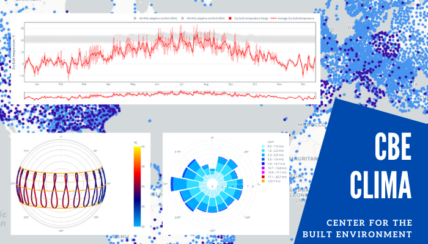
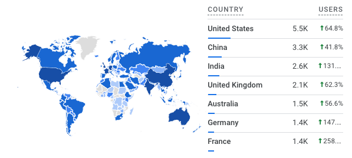

---
tags:
  - tool
keywords: 
  - climate analysis
  - passive design
image: ./img/clima.png
description: This article describes the CBE Clima Tool (Clima) a free and open-source web application that provides a series of interactive visualization
last_update:
  author: Federico Tartarini
---

# CBE Clima Tool

I developed, helped designing, and maintaining the [CBE Clima Tool](https://clima.cbe.berkeley.edu/) (Clima) a free and open-source web application that offers easy access to
publicly available weather files (in EPW format) specifically created for building energy simulation and
design. 
It provides a series of interactive visualization of the variables therein contained and several
derived ones. 

 

It is aimed at students, educators, and practitioners in the architecture and engineering
fields. 
Since its launch has been consistently recording over 33,000 yearly unique users from over 70
countries worldwide, both in professional and educational setting.

 

