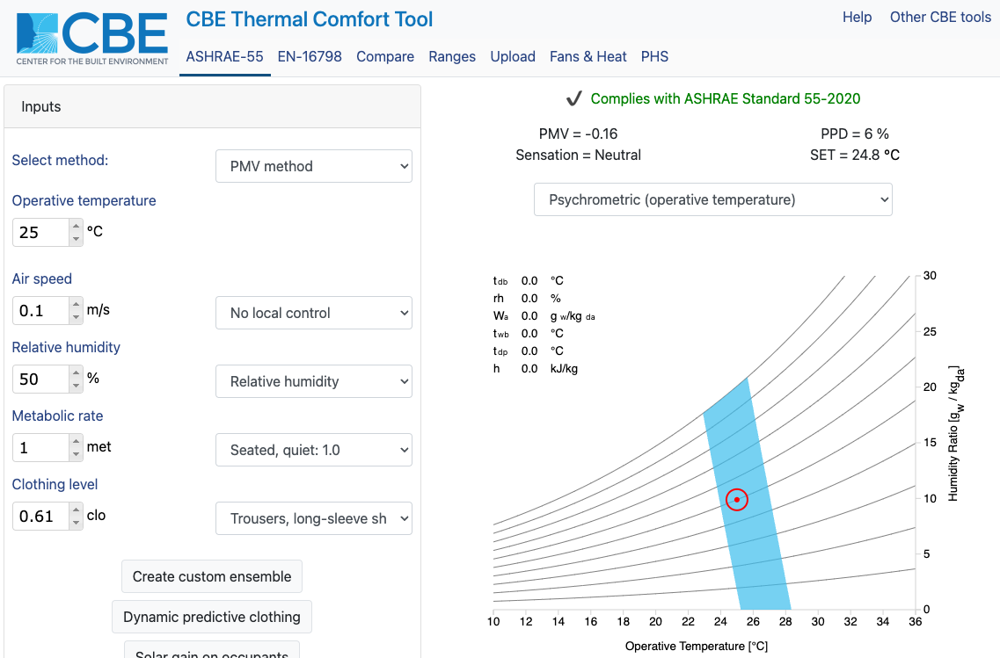
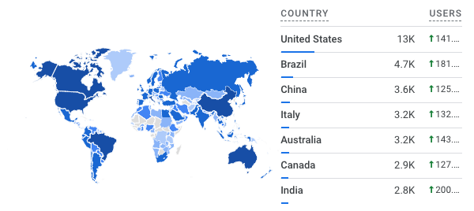

---
tags:
  - tool
keywords: 
  - thermal comfort
  - thermal stress
  - thermal strain
  - predicted mean vote
  - adaptive thermal comfort
description: the CBE thermal comfort tool is a web tool for thermal comfort calculations and visualizations
image: ./img/comfort_tool.png
last_update:
  author: Federico Tartarini
---

# CBE Thermal Comfort Tool

I contributed to the development, and I am currently maintaining the [CBE Thermal Comfort Tool](https://comfort.cbe.berkeley.edu/), an advanced web-tool developed by the Center for the Built Environment.
It provides an online interface for thermal comfort calculations and visualizations. 
It adheres strictly to the guidelines of industry standards ASHRAE 55–2017, ISO 7730:2005, and EN 16798–1:2019.

Incorporating a spectrum of thermal comfort models, it hosts the Predicted Mean Vote (PMV), Standard Effective Temperature (SET), adaptive models, local discomfort models, SolarCal, and dynamic predictive clothing insulation. 
This robust compilation of models serves as a comprehensive resource for specialists in the field.

This tool excels in its dynamic and interactive visualizations of thermal comfort zones, delivering a user experience that extends beyond static data representation, into a more interactive and engaging environment for data analysis.

The CBE Thermal Comfort Tool has an annual user base exceeding 50,000 worldwide, proving its utility to a broad array of professionals. 
Its versatility and comprehensive features make it indispensable to engineers, architects, researchers, educators, facility managers, and policymakers. 
Thus, it serves as a vital instrument in advancing understanding and application of thermal comfort standards and models.

We published the code open-source and describe the tool in a [scientific paper](https://www.scopus.com/record/display.uri?eid=2-s2.0-85087591886&origin=resultslist&sort=cp-f) 

  

