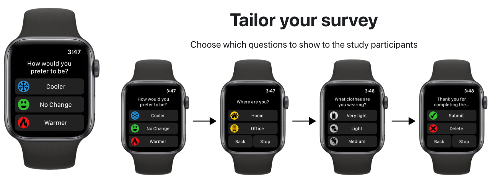

---
tags:
  - tool
keywords: 
  - survey
  - physiological data
  - apple
  - wearable
  - longitudinal study
image: ./img/cozie.png
description: This article describes Cozie an iOS application for watch surveys and physiological data collection
last_update:
  author: Federico Tartarini
---

# Cozie

> An iOS application for watch surveys and physiological data collection

:::info

Cozie can be downloaded for free from the [App Store](https://apps.apple.com/sg/app/cozie/id1625029501). 
You can also find more information about the tool, its features, and its documentation at this [URL](https://cozie-apple.app/).

:::

Have you ever wondered how people feel about their environment and what factors influence their comfort and satisfaction? 
Do you want to collect real-time feedback from your occupants, customers, or users in a scalable and non-intrusive way? 
If so, you might be interested in Cozie, an open-source mobile and smartwatch application for the Apple Watch.

Cozie is a platform that allows people to complete a watch-based micro-survey and provide real-time feedback about environmental conditions via their Apple Watch. 
It leverages the built-in sensors of the smartwatch to collect physiological (e.g., heart rate, activity) and environmental (sound level) data. 
Cozie also enables researchers and practitioners to send push notifications and reminders to participants, and access data in real-time.

<iframe width="100%" class="youtube-video" src="https://www.youtube.com/embed/5e4FwVydYRE?si=Wsk6qayHUpCtKyvK" title="YouTube video player" frameborder="0" allow="accelerometer; autoplay; clipboard-write; encrypted-media; gyroscope; picture-in-picture; web-share" allowfullscreen></iframe>

The key features and benefits of Cozie are:

**Customizable and flexible**: Cozie allows you to design your micro-survey questions and question flow based on your research objectives and requirements. 
You can also modify and edit the source code to customize the app’s functionalities and appearance. 
Cozie is compatible with iOS 14 and Apple Watches Series 3 or newer and can be downloaded from the [App Store](https://apps.apple.com/sg/app/cozie/id1625029501) or deployed using the open-source code base.

**User-friendly and convenient**: Cozie makes it easy for users to provide feedback by tapping on the Cozie icon on their watch face, which will start a survey on the Apple Watch.
The surveys are short and simple and can be completed in a few seconds.
Users can also edit their answers or abort the survey if they wish.
Hence, Cozie reduces the effort and time required for users to access the survey, compared to using pen and paper, phone, or web applications.

**Rich and reliable data**: Cozie collects not only subjective feedback from users, but also objective data from the watch sensors, such as heart rate, blood oxygen saturation, step count, walking distance, stand time, and noise.
Cozie also obtains the GPS location of the user each time a survey is completed.
These data can be used to correlate and analyze the users’ perceptions, preferences, and needs with their physiological and environmental conditions.

**Scalable and secure**: Cozie can facilitate large-scale and longitudinal data collection from a diverse and representative sample of users.
Cozie also ensures data security and privacy by obtaining user consent, encrypting data transmission, and anonymizing data storage.
Cozie also has several applications beyond research settings, such as integration into building systems control, interventional messages for occupants, and space utilization studies.

If you are interested in learning more about Cozie, you can visit the [official website](https://cozie-apple.app/), where you can find the documentation, video tutorials, and open-source code. 
You can also contact the Cozie team at cozie.app@gmail.com for any inquiries or feedback. 
Cozie is a powerful and innovative tool for collecting data and understanding people’s needs and preferences in their environment. 
I hope you will give it a try and see how Cozie can help you achieve your goals.

Cozie was developed by a team of researchers from BEARS, the National University of Singapore, the University of California, Berkeley, and the University of Sydney, who have been using it to conduct various studies on environmental quality, personal comfort, and occupant behaviour. 

## Reference
[Federico Tartarini et al. Cozie Apple: An iOS mobile and smartwatch application for environmental quality satisfaction and physiological data collection 2023 Journal of Physics: Conference Series,2600,142003. ](https://iopscience.iop.org/article/10.1088/1742-6596/2600/14/142003)
