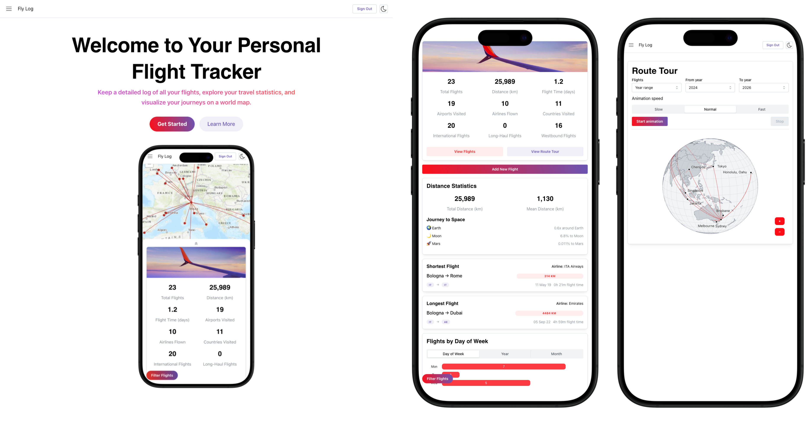
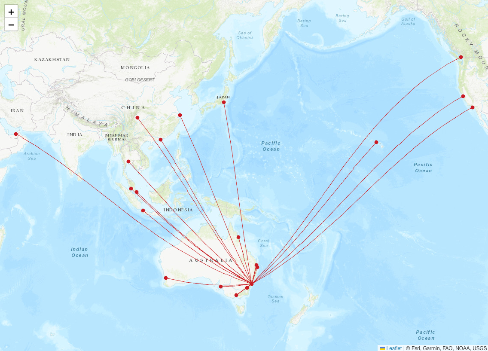
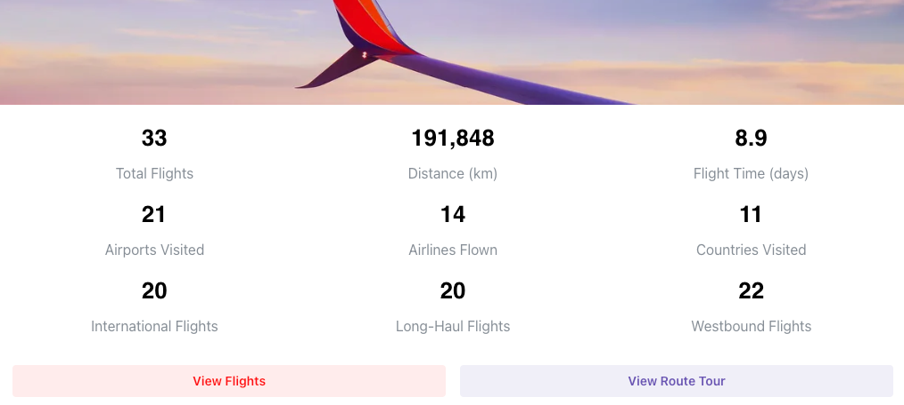

---
tags:
  - tool
  - web application
keywords: 
  - flight tracker
  - travel statistics
  - artificial intelligence
  - open-source
  - firebase
  - map visualization
  - free-to-use
image: ./img/fly-log.png
description: This article describes Fly Log, an open-source, AI-powered flight tracker and visualizer web application.
last_update:
  author: Federico Tartarini
---

# Fly Log

> An open-source, AI-powered flight tracker to map your journeys and travel statistics

I love keeping track of my travel statistics and visualizing my routes on a map, but the existing solutions were either too clunky, required manual data entry, or locked my data behind a paywall. 
I got tired of maintaining a boring spreadsheet, so I decided to build my own solution: [Fly Log](https://fly-log.netlify.app/).

:::info

[Fly Log](https://fly-log.netlify.app/) is a free, open-source web application (https://fly-log.netlify.app/) designed to help frequent flyers and aviation enthusiasts visualize their time in the air. 
It provides a clean, personalized dashboard of your travel history without the usual friction of manual data entry.
You can also view the open-source code base, contribute, or fork the project on [GitHub](https://github.com/FedericoTartarini/fly-log).

:::

## Key Features

The key feature of Fly Log include:

**Interactive global maps**: Every flight you log is automatically plotted on a world map. The application draws connective lines between your departure and arrival airports to give you an immediate visual footprint of your journeys across the globe.

**Lifetime statistics**: The app automatically calculates your personal aviation metrics. You can instantly see your total hours spent in the air, your total number of trips, and a breakdown of your most frequently used airlines directly on your dashboard.

**AI-powered uploads**: The biggest friction point with flight trackers is data entry. Nobody wants to sit down and manually type out IATA airport codes, departure dates, and flight times. To solve this, I integrated an AI-powered extraction tool using Google’s Gemini model directly into the app. You simply copy the text from your airline confirmation email and paste it into Fly Log. The AI instantly parses the unstructured text, identifies the cities, dates, and the airline company, and securely saves it to the database as structured data. It turns a tedious manual task into a quick copy-paste job.

  

**Replay your journeys**: Fly Log allows you to replay your flights in a dynamic animation. You can watch the path of each flight unfold on the map, giving you a unique way to relive your travel experiences.

  

**Secure and private**: I built Fly Log with privacy in mind. All your flight data is securely stored in a Firebase database, and I have implemented strict access controls to ensure that only you can view and manage your information.

**Free and open-source**: I wanted a tool that worked smoothly without restrictions, so I made Fly Log completely free to use and open-source. If you are a developer interested in how to use AI for structured data extraction, or how to link