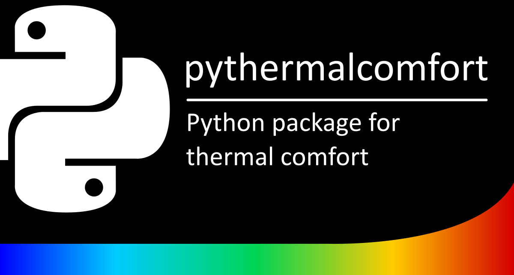

# pythermalcomfort

>A Python package for thermal comfort, stress, and strain modelling

Have you ever wondered how to calculate thermal comfort indices in Python? 
If you are a researcher or a professional working in the building sector, you may have encountered the need to assess the indoor thermal environment using models such as Predicted Mean Vote (PMV), adaptive comfort, or Standard Effective Temperature (SET). 
These models are based on standards such as ASHRAE 55, EN 16798, or ISO 7730, which provide the equations and the programming code to calculate them. 
However, these standards are not freely available and the code is written in JavaScript or BASIC, which may not be convenient for Python users.

That’s why we developed [pythermalcomfort](https://pypi.org/project/pythermalcomfort/), a Python package that allows you to calculate the most common thermal comfort and thermal stress indices in compliance with the main thermal comfort standards. 
pythermalcomfort is the only Python package available on PyPI that contains a comprehensive list of validated thermal comfort functions.

 

You can use it to calculate:

* Whole body thermal comfort indices (e.g., PMV, adaptive models, SET)
* Thermal stress and tress
* Physiological variables (e.g., sweat loss, skin wettedness, core temperature, skin temperature)
* Local discomfort (e.g., vertical temperature gradient, ankle draft)
* Clothing insulation (e.g., from outdoor temperature, from list of garments)
* Psychrometric properties of air (e.g., enthalpy, vapor pressure, dew point)
* Solar gain on people (e.g., effective radiant field, mean radiant temperature increment)

pythermalcomfort is easy to install and use. 
You can download it from PyPI using the command `pip3 install pythermalcomfort`. 
You can then import the functions and dictionaries you need from the pythermalcomfort module. 
For example, you can calculate the PMV and PPD values for a given set of environmental and personal parameters using the pmv_ppd function. 
You can also specify the system of units (SI or IP) and the standard (ASHRAE or ISO) you want to use. 
pythermalcomfort will also alert you if the input values are outside the applicability limits of the standard.

We have also created detailed documentation and tutorial videos to guide you on how to use pythermalcomfort. 
You can find them on the official [project website](https://pythermalcomfort.readthedocs.io/en/latest/). You can also check the source code and contribute to the [project on GitHub](https://github.com/CenterForTheBuiltEnvironment/pythermalcomfort).

pythermalcomfort is a powerful tool to conduct thermal comfort analyses. 
You can use it for educational, research, or industrial purposes. 
You can also integrate it with other Python packages or applications. 
For example, you can use it with pandas to analyze thermal comfort data, or with matplotlib to visualize thermal comfort results.

We hope that pythermalcomfort will help you to improve your thermal comfort knowledge and practice. We welcome your feedback and suggestions to make pythermalcomfort better and more useful. Please feel free to contact us at cbecomforttool@gmail.com if you have any questions or comments.

Thank you for reading and happy coding! 😊