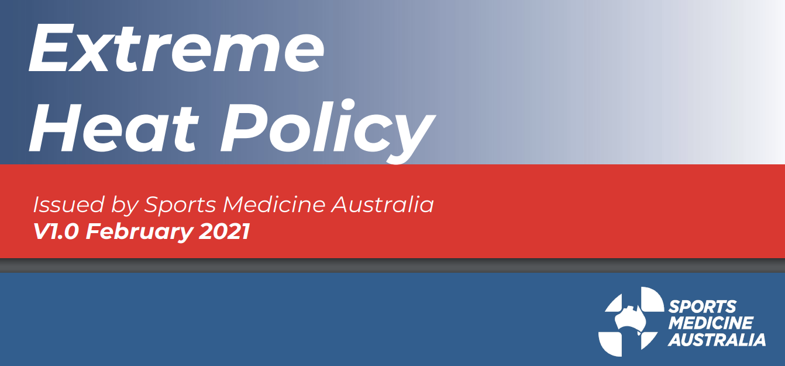
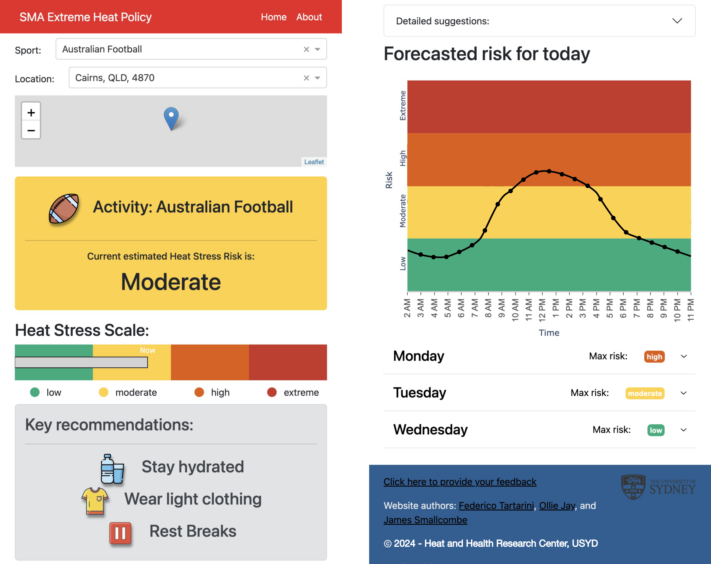

---
tags:
  - tool
keywords: 
  - thermal stress
  - thermal strain
  - heat health risk
  - prevention
  - heatwave
  - extreme heat
  - sports
description: The SMA Extreme Heat Tool is a free web application that provides personalized recommendations to mitigate heat stress risk during physical activity.
image: ./img/sma-app.png
last_update:
  author: Federico Tartarini
---

# SMA Extreme Heat Tool

**Purpose**: The Australian climate is characterized by hot and humid summers. 
While fatal heat injuries during sports in athletes are rare, thousands of people suffer from heat-related illnesses each year. 
In 2021, Sports Medicine Australia developed a new heat policy based on a biophysical model. 
It provides recommendations about which cooling strategies should be used by athletes to mitigate their heat stress risk. 

 

One major limitation of this policy is its accessibility and usability. 
Users need to consult a PDF online to determine whether environmental conditions may pose some risk to their health. 
This is a labour-intensive process that needs to be repeated multiple times. 
To overcome these issues we developed an [online, free-to-use, and cross-platform web tool](https://sma-heat-policy.sydney.edu.au/).

 

Coaches, medical teams, athletes, and people from the community can use it to check the current and forecasted heat stress risk conditions.

**Method**: We developed the tool using Plotly Dash and wrote the front-end and back-end in Python. 
We shared the code publicly. 
The recommendations provided in the application are personalized and are calculated based on the current location and the type of physical activity selected by the user. 
People can choose one of the 40 most popular sports played in Australia. 

**Results**: We were able to develop a free web application that is intuitive to use and allows anyone who has access to a smartphone to check their heat stress risk. 
Moreover, we can provide users with strategies that can be employed to minimize their risk of suffering from heat-related illnesses. 
The use of our application is not limited to Australia. 
It can be used in any country since weather forecast data are pooled as a function of the user's GPS coordinates.

**Conclusion**: Our application offers simple-to-access, evidence-based advice for avoiding unnecessarily interruption of play while safeguarding the health of people engaging in sports and physical activity from the negative effects of extreme heat.
